<div align="center">


Department of Computer Science  

COMP4300-Graduation Project  

Manhaji  

AI-Powered Personalized Learning & Performance Analytics  

Prepared by:  

Abdallah Mattour			1223061  

Basel Bahbouh			1222263  

Yaqeen Azamta			1221736  

Supervisor: Faisal Shehadeh  

Section: 36  

Section – B  

Title of Project: AI-Powered Personalized Learning & Performance Analytics  

Project No:	36  

Supervisor:	Dr. Faisal Shehadeh  

Key Areas:	Adaptive learning, Learning analytics, AI assessment models,  

Gamification.  

Section – C  

Student Signature: ___________________________  

Date Submitted: ____________________  

First Supervisor Name: ____________________  

First Supervisor Signature: ____________________  

Date Approved: ____________________  

</div>

---


# Abstract


In this paper a proposal for an AI-based interactive learning platform targeted at early-grade students in Palestine has been presented. The system utilizes voice narration, visual context and interactive questioning to provide literacy support for learners. One of the key characteristics is the fact that it has a speech-oriented interface that encourages student interaction with oral responses, which can be assessed through voice recognition and natural language processing. According to each student's results, the platform scales difficulty and creates a personalized learning path.


The motivation of this work is due to the general educational inconsistency (and inflexibility) that results from having pre-teens managing highly differential developmental rates and styles, especially during traditional instruction. Most of the current digital tools are not curriculum-linked and they do not include speech interaction, making this method less suitable for young children.


It also offers teachers real-time analytics on a dedicated dashboard to track progress, identify learning gaps, and intervene at the right moment. The combination of adaptive learning, voice interactivity and local curriculum is also especially applicable in untapped educational markets.


Our study suggests that combining AI with multimodal delivery and real-time feedback can dramatically improve engagement and personalization in early learning. It is an approach that underpins scalable, inclusive education solutions.


# Table of Content

- Abstract
- Acknowledgements
- Chapter1: Introduction
  - General overview
  - Motivation and problem statement
  - 1.0 Methodology
  - 1.1 Aims & Objectives
      - Main Aim
      - Objectives
  - 1.2 Overview of the technical area
  - 1.3 Overview of the report
- Chapter2: Background / Literature Review
  - 2.1 Details of relevant theory:
  - 2.2 Review of past/reported work:
  - 2.3 Tools and Technology
- Chapter 3: System Analysis and Design
  - 3.1 Product Description:
      - 3.1.1 System Objectives:
      - 3.1.2 System Main Features:
      - 3.1.3 Operating Environments
      - 3.1.4 Constraints
      - 3.1.5 User Requirements
      - System Requirements
  - 3.2 Functional Decomposition (Use Case Diagram)
      - 3.2.1 Actors (actor list and description of their roles)
      - 3.2.2 Use Cases
      - UC-3: Adaptive Question Selection
      - UC-4: Personalized Learning Path Generation
      - UC-5: Teacher Views Student Analytics
      - UC-6: Administrator Manages Educational Content
      - 3.2.3 Use Cases Diagram
  - 3.3 System Models
      - 3.3.1 Class Diagram
      - 3.3.2 Sequence Diagram:
      - 3.3.3 Activity Diagram
      - 3.3.4 State Chart Diagram
  - 3.4 System Architecture
      - 3.4.1 Sub-System
      - 3.4.2 Software Architecture
      - 3.4.3 Deployment Diagram
  - 3.5 Data Management and ERD
  - 3.6 AI Implementation
      - 3.6.1 Generative AI — Large Language Model (Google Gemini)
      - 3.6.2 Speech Understanding — Transcription and Pronunciation Scoring
      - 3.6.3 Learner Modelling — Bayesian Knowledge Tracing
      - 3.6.4 Adaptive Content Selection — Personalised Quiz Generation
  - 3.7 Implementation and Evaluation
      - 3.7.1 Development Summary
      - 3.7.2 Knowledge-Tracing Walkthrough
  - 3.8 How Manhaji Builds Its Question Bank from Textbooks
      - Stage 1 – PDF Parsing and Chapter Extraction
      - Stage 2 – AI Question Drafting
      - Stage 3 – Automated Validation
      - Stage 4 – Human Review and Final Audit
- Chapter 4: Testing
  - 4.1 Testing Methodology
    - 4.1.1 Black-Box Testing
    - 4.1.2 White-Box Testing
    - 4.1.3 Automated Unit and Widget Testing
  - 4.2 Integration and System Testing
    - 4.2.1 Authentication and Access Control
    - 4.2.2 Lesson Delivery
    - 4.2.3 Quiz Answering and Scoring
    - 4.2.4 Speech and Handwriting Assessment
    - 4.2.5 Adaptive Learning and Knowledge Tracing
    - 4.2.6 AI Analytics and Reporting
    - 4.2.7 Teacher and Parent Dashboards
  - 4.3 Testing Results and Analysis
- Chapter 5: Implementation and UI
  - 5.1 Implementation Overview
  - 5.2 System Implementation
    - 5.2.1 Project Structure
    - 5.2.2 Backend Implementation
    - 5.2.3 Adaptive Learning Engine
    - 5.2.4 AI Services Integration
    - 5.2.5 Frontend Implementation
    - 5.2.6 Curriculum Seeding
    - 5.2.7 Database Implementation
  - 5.3 User Interface
    - 5.3.1 Splash and Login
    - 5.3.2 Student Home Dashboard
    - 5.3.3 Subject and Lessons
    - 5.3.4 Lesson View
    - 5.3.5 Quiz and Question Types
    - 5.3.6 Pronunciation and Tracing
    - 5.3.7 AI Performance Report
    - 5.3.8 Leaderboard
    - 5.3.9 Teacher Dashboard
    - 5.3.10 Parent Dashboard
  - 5.4 Chapter Summary
- Chapter 6: Conclusion
  - 6.1 Review of the Project
  - 6.2 Achieved Objectives
  - 6.3 Limitations
  - 6.4 Future Work
  - 6.5 Development Timeline
- Bibliography
- Appendices
  - Use Case Specifications:
  - Glossary
  - Main Software Components
    - Backend Components
    - AI Services
    - Frontend (Flutter) Components


# Table of Figures

- Figure 1: ABCmouse
- Figure 2: LittleLit.ai
- Figure 3: Khanmigo
- Figure 4: Manhaji
- Figure 5: Use Cases Diagram
- Figure 6: Conceptual class diagrams
- Figure 7: Class Diagram
- Figure 8: Sequence Diagram UC-1(Student Accesses Lesson Content)
- Figure 9: Sequence Diagram UC-2 (Student Generates Gamified Quiz)
- Figure 10: Sequence Diagram UC-5(Teacher Views Student Analytics)
- Figure 11: Activity Diagram UC-1 (Student Accesses Lesson Content)
- Figure 12: Activity Diagram UC-2(Student Generates Gamified Quiz)
- Figure 13: Activity Diagram UC-5(Teacher Views Student Analytics)
- Figure 14: State Chart Lesson Session
- Figure 15: State Chart Gamified Quiz
- Figure 16: Software Architecture Diagram
- Figure 17: Deployment Diagram
- Figure 18: ERD
- Figure 19: Backend (Spring Boot) project structure.
- Figure 20: Frontend (Flutter) project structure.
- Figure 21: Splash screen and student login.
- Figure 22: Student home dashboard with subjects and the Challenge-Me banner.
- Figure 23: Subject screen listing its lessons.
- Figure 24: Lesson view with narration and illustrated content.
- Figure 25: Answering a question during a quiz.
- Figure 26: Pronunciation (voice) and letter-tracing questions.
- Figure 27: AI-generated performance report.
- Figure 28: Gamified leaderboard.
- Figure 29: Teacher analytics dashboard.
- Figure 30: Parent dashboard.


# List of tables

- Table 1: App Comparison
- Table 2: TC-01 – Student Login with Valid Credentials
- Table 3: TC-02 – Login Rejected with Invalid Credentials
- Table 4: TC-03 – Role-Based Access Control
- Table 5: TC-04 – Multimodal Lesson Delivery and Narration
- Table 6: TC-05 – Multiple-Choice Scoring and Retry Logic
- Table 7: TC-06 – True / False Question in Arabic (RTL)
- Table 8: TC-07 – Fill-in-the-Blank Answer Evaluation
- Table 9: TC-08 – Ordering Question Sequence Check
- Table 10: TC-09 – Image-Based Multiple Choice (Picture Options)
- Table 11: TC-10 – Pronunciation Scoring with Graceful Fallback
- Table 12: TC-11 – Letter Tracing Capture and Scoring
- Table 13: TC-12 – Knowledge Tracing and Personalized "Challenge Me" Quiz
- Table 14: TC-13 – AI Performance Report Generation
- Table 15: TC-14 – Personalized Learning-Path Generation
- Table 16: TC-15 – Teacher Analytics Dashboard
- Table 17: TC-16 – Parent Progress Report
- Table 18: Key database tables
- Table 19: Manhaji Development Timeline
- Table 20: Main Backend Components
- Table 21: Main AI Services
- Table 22: Main Frontend Components


# Acknowledgements


First and foremost, we would like to express our sincere gratitude to Allah for granting us the strength, patience, and ability to successfully reach this stage of our academic journey.


We would like to extend our special appreciation and thanks to Dr. Faisal Shehadeh


for his continuous guidance, valuable support, and encouragement throughout the development of this project. We are truly grateful to have him as our supervisor.


We also wish to thank all our professors, staff members, and colleagues at the Computer Science Department, Faculty of Engineering and Technology, Birzeit University, for their cooperation and support during our studies.


Finally, we would like to express our deepest thanks to our families and friends, who taught us the value of learning and provided us with unconditional support, motivation, and encouragement throughout every step of our lives.


# Chapter1: Introduction


## General overview


Technology has reshaped how lessons are delivered and how learners practise and retain what they learn. Used well, multimodal and interactive tools let teachers explain a concept from several angles and give learners more guided, self-paced practice — which research consistently links to stronger engagement, understanding and retention, especially for young children.


These benefits, however, depend on tools that adapt to each learner. Most digital education platforms remain text-heavy and one-size-fits-all, which poorly serves early-grade students who cannot yet read or write fluently. The gap is widest in disrupted, under-resourced settings such as Palestine, where early education faces frequent interruptions, scarce materials and high dropout at the primary stage.


This project argues that a curriculum-aligned, speech-enabled and adaptive learning platform is not an optional supplement but essential infrastructure for early-grade learning under such conditions — one that meets young learners where they are, through listening and speaking rather than reading and writing.


## Motivation and problem statement


In the early grades there is a growing mismatch between how lessons are taught and how 6–9-year-olds actually learn. Standardised, text-dominated content assumes reading and writing skills that are still forming, so many young learners struggle with static, one-size-fits-all material — a problem that is sharper in disrupted, low-resource settings such as Palestine.


Most digital tools do little to close this gap: they are non-interactive and inflexible. They cannot listen to a child, narrate a lesson, or give immediate feedback based on how that particular student is doing. Teachers, in turn, lack real-time insight into each learner’s progress and fall back on infrequent assessments.


Manhaji addresses this gap. It is an AI-powered learning platform that delivers lessons through audio and visuals, supports spoken interaction, tracks progress at the micro-skill level, and adapts to each student — while giving teachers an analytics dashboard that surfaces individual and class learning patterns. The goal is not only to deliver content more efficiently, but to make early-stage learning interactive, adaptive and student-centred.


## 1.0 Methodology


Manhaji was built using an incremental, iterative approach. The core student flow — log in, open a lesson, answer questions, record progress — was implemented first, and each later capability (speech scoring, tracing, the adaptive engine, AI reports, and the teacher and parent dashboards) was added on top of a working system and verified before moving on. This kept the application demonstrable at every stage and made regressions easy to catch.


The system follows a client–server architecture chosen for a clean separation of concerns and broad reach. The student, teacher and parent clients are a single cross-platform Flutter application (mobile for students, a web build for teachers and administrators), which avoids maintaining separate codebases. The Flutter client uses the Provider pattern for state management and communicates over a REST API with a Spring Boot (Java 17) backend. The backend is organised into controller, service and repository layers and persists data to MySQL through JPA/Hibernate, so the schema evolves directly from the entity classes.


Several design choices follow from the target users and setting. Authentication is stateless (signed JWT) with role-based authorization, so one backend serves all four roles securely. The AI capabilities — answer evaluation, hint and report generation, speech transcription, and text-to-speech — are isolated behind their own service interfaces, and each call is guarded with a graceful fallback, so a missing key or a service outage degrades to a friendly message instead of failing. The learner model uses Bayesian Knowledge Tracing, chosen because it is well-established, interpretable and lightweight enough to run after every answer. Curriculum content is authored as JSON and loaded by a seeder, so new lessons, subjects and even new question types can be added largely without code changes.


Throughout development the project used Git version control and an automated test suite — JUnit 5 / Mockito on the backend and provider and widget tests on the Flutter client — run on every change, together with a content-audit test that enforces schema and quality rules across the question bank. Manual testing on a device and in the web build complemented the automated tests at each milestone.


## 1.1 Aims & Objectives


#### Main Aim


To design and develop an AI-powered learning platform that supports early-grade students by using voice narration, visual learning aids, real-time speech-based assessments, and personalized learning paths all while providing teachers with actionable analytics to track, support, and enhance student performance.


#### Objectives


- Intelligent Audio-Visual Instruction:


Create a computerized lesson delivery system that provides straight forward (easy for a child to comprehend) explanations delivered with voice narration, relevant pictures and multimodal visual supports so as to aid students who do not have reading levels in reaching the messages.


- Speech-Based Student Assessment:


Utilize speech-to-text models and AI answer-analysis techniques to assess spoken answers, making it possible for young learners to take part even if they are not yet able to read/write.


- Adaptive Questioning and Micro-Skill Tracking:


Serve each student a series of questions that dynamically adapt based on their performance, engagement, and mastery of micro-concepts to ensure that each learner receives challenges appropriate to their current skill level.


- Personalized Learning Pathways:


Automatically produce personalized learning plans utilizing performance data collected by formative assessments to spot strengths and diagnose learning gaps at an early stage, with suggested lessons or practice exercises.


- Teacher Analytics and Monitoring Tools:


Provide teachers with a comprehensive dashboard displaying lesson content, student activities, real-time analytics, mastery progression, and AI-predicted risk levels to support timely intervention.


## 1.2 Overview of the technical area


This project uses AI for early-grade education. It melds several technologies — voice recognition, text-to-speech, adaptive learning systems and data analytics — into a single platform that enables students to learn in a more personalized and interactive manner.


The technical relevance spans the following:


- Adaptive learning: to monitor each student’s strengths and weaknesses and adjust their lesson plan accordingly.
- Learning analytics: to provide data to teachers via a dashboard that enables educators to see what is going well and where the challenges for all pupils lie.
- Speech technologies: students can speak answers and hear lessons, rather than being able only to read them or type them.
- AI assessment models: for evaluating spoken responses and adapting questions according to the student’s level.


## 1.3 Overview of the report


This report describes how the Manhaji platform was designed, developed and tested. It is organised into six chapters:


- Chapter 1 introduces the problem, the motivation, and the project’s aims and objectives.
- Chapter 2 reviews the relevant background and compares Manhaji with related tools and technologies.
- Chapter 3 presents the system analysis and design: requirements, use cases, system models, architecture and the data model.
- Chapter 4 describes the testing of the system and analyses the results.
- Chapter 5 covers the implementation and the user interface of the delivered application.
- Chapter 6 concludes the report by reviewing the project against its objectives and outlining future work.


# Chapter2: Background / Literature Review


## 2.1 Details of relevant theory:


- Adaptive Learning Systems in Early Education:


Adaptive learning systems (ALS) personalize teaching material based on each student's performance and learning speed. This is especially important in early education, where children develop at different rates. Educational theories like mastery learning and formative assessment emphasize continuous evaluation and real-time instructional adjustment.


Many existing adaptive platforms are built for older students and depend on typed text input—something younger learners who haven’t yet mastered reading or writing may struggle with.


Manhaji takes a different approach by using speech-based interaction and real-time performance tracking. It listens to spoken input, analyzes response accuracy and error patterns, and adjusts lesson difficulty immediately—so the learning adapts while the activity is happening, not afterward.


- Learning Analytics and Micro-Skill Tracking for Early Intervention:


Learning analytics help gather and analyze data to improve student outcomes. Most platforms rely on basic data points like test scores or task completion, which don’t reveal the root of learning challenges.


Recent learning analytics research emphasizes micro-skill tracking as a method for early identification of learning gaps —such as how clearly a student pronounces words, how well they understand a concept, and how consistent their answers are. It also looks at how fast they respond and how often they repeat errors to spot early signs of struggle.


This allows for early intervention and gives teachers clear, useful data. Dashboards and alerts ensure educators can respond quickly—before small gaps grow into major setbacks.


- Voice-Based Learning and Speech Analytics


Voice-based learning reduces dependence on reading and writing, which is ideal for young students. Research shows that allowing children to speak their answers and receive verbal feedback reduces mental strain and boosts engagement.


Most voice tools like digital assistants are built to recognize commands—not assess how much a child has actually learned.


Manhaji combines speech-to-text technology with AI scoring to evaluate spoken responses. It measures correctness, fluency, and consistency, gives instant feedback, and accurately tracks each student’s learning progress.


- Gaps in Curriculum Alignment and Localization:


Many digital platforms don’t align with local educational standards, which limits how well they can be integrated into actual classrooms.


In Palestine, early education follows a structured national curriculum with clearly defined learning goals. When platforms don’t align with this, it creates gaps between what students learn online and what’s taught in school.


Manhaji is fully aligned with the Palestinian National Curriculum. Every lesson, exercise, and learning outcome is mapped directly to official standards, ensuring classroom relevance and smooth adoption in real learning environments.


## 2.2 Review of past/reported work:


The goal of this app is to support the education of Palestinian Students through the Palestinian National Curriculum using artificial intelligence to provide them with information that helps them better understand the material through simplified explanations and study interactive textbook questions along with the option to self-assess their understanding of each lesson after they complete it.


The feature that sets this app apart from other programs is its ability to use voice interaction, voice recognition, and voice-to-text analysis. Parents receive regular progress reports based on their child's interaction with the app and monitoring of their overall performance, giving parents a clear picture of how well their child is doing compared to his/her peers. The following are some examples of the applications used in these areas:


- ABCmouse:
- ABCmouse is a website and mobile app available on both Android and iOS platforms that was developed to assist in the education of young children (ages 2-8) through online learning activities. The site provides interactive activities that teach children reading, math, science, and art through games, books, and video lessons. Children can navigate through a structured curriculum based on their age and skill level. Parents can track their child's progress. The site’s interface is designed to be easy for young children to use, making it safe for them to access. Additionally, the lack of social interaction capability reduces the opportunities for older children to interact with children on ABCmouse.


<div align="center">
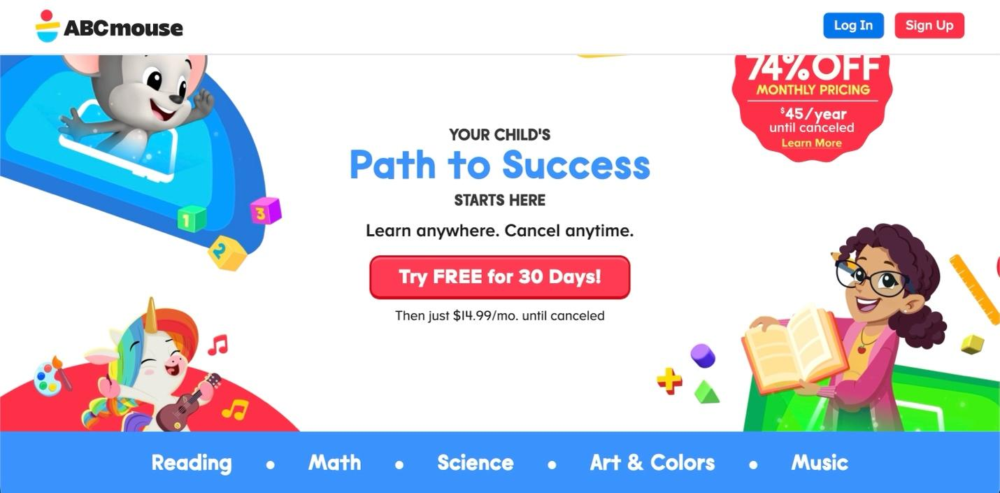
</div>
<p align="center"><em>Figure 1: ABCmouse</em></p>


- LittleLit.ai:
- LittleLit.ai is a web site and mobile app that uses artificial intelligence to assist young children in acquiring basic literacy skills. LittleLit.ai provides children with opportunities to read and write using the same AI-based technology as many professional authors do. LittleLit.ai encourages children to be creative and develop their language skills by allowing them to interact with AI tools to create and explore  stories. The content on LittleLit.ai is designed for children of all ages and helps to promote creativity, language development, critical thinking, and other key skills. The application creates a safe, controlled environment for children to learn and provides parents and educators with guidance in guiding their children's educational journey. Lastly, LittleLit.ai has a strong emphasis on the responsible and educational use of Artificial Intelligence by young learners.


<div align="center">
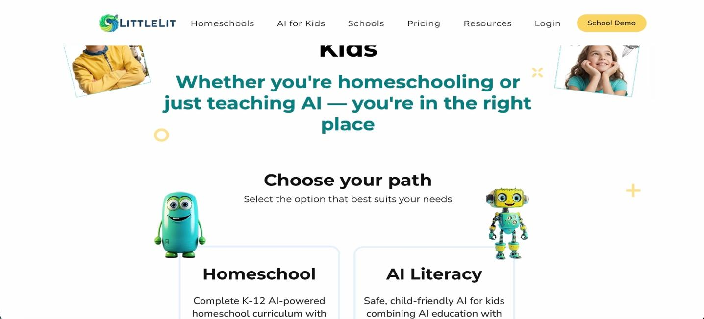
</div>
<p align="center"><em>Figure 2: LittleLit.ai</em></p>


- Khanmigo:
- Khanmigo is an education resource and website created by Khan Academy to help educators, parents, and learners. Khanmigo offers personalized artificial intelligence (AI)-based tutoring for all learners. The Khanmigo platform provides instructions to students on how to solve problems rather than providing answers directly, and by providing guiding questions and strategies to help them develop critical thinking skills. In addition, all Khanmigo services are developed with alignment with both parent/student needs and with the best practices in teaching. Khanmigo integrates with Khan Academy to offer educational content for Mathematics, Science, Technology, and Humanities. In addition, the platform includes resources and tools for teachers to help them with lesson planning and teaching preparation.


<div align="center">
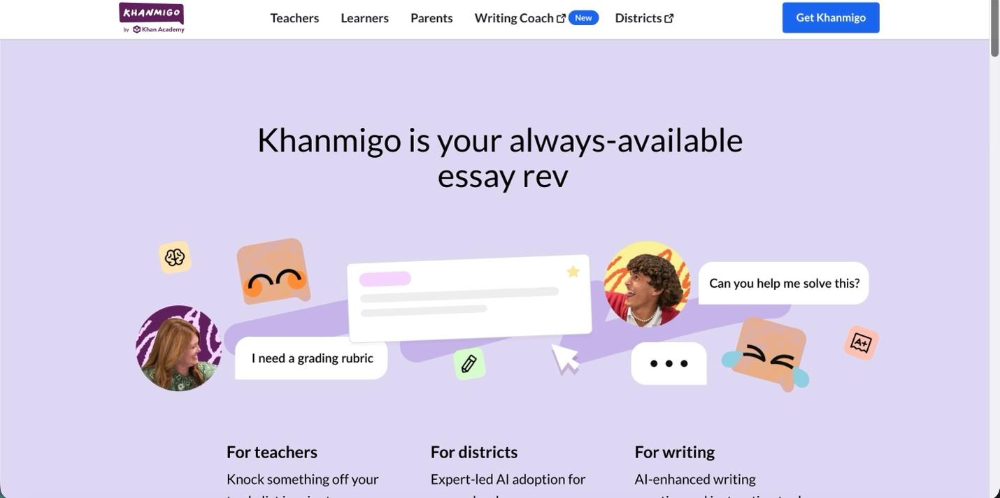
</div>
<p align="center"><em>Figure 3: Khanmigo</em></p>


- Manhaji:


Manhaji offers early-grade students an interactive approach to learn through a structure designed around the actual school curriculum. The current build covers Grades 1 and 2 across four subjects (Arabic, English, Mathematics, and Religious Education), with curriculum for the higher grades prepared for later seeding. The primary goal of the app is to enhance a student’s ability to read, comprehend, and apply knowledge through structured lessons and textbook-based questions, and it also provides students with a way to measure their progress over time against their lesson goals.


- What sets our app apart from other similar applications available today is our emphasis on tracking and gauging student progress and tracking how teachers/parents can view those reports, and how both teachers and parents will be able to monitor their student’s learning progress. Additionally, the app has been designed to accommodate both school affiliated, and an independent learning environment, therefore it provides maximum flexibility and the greatest relevance based on the individual curriculum.


<div align="center">
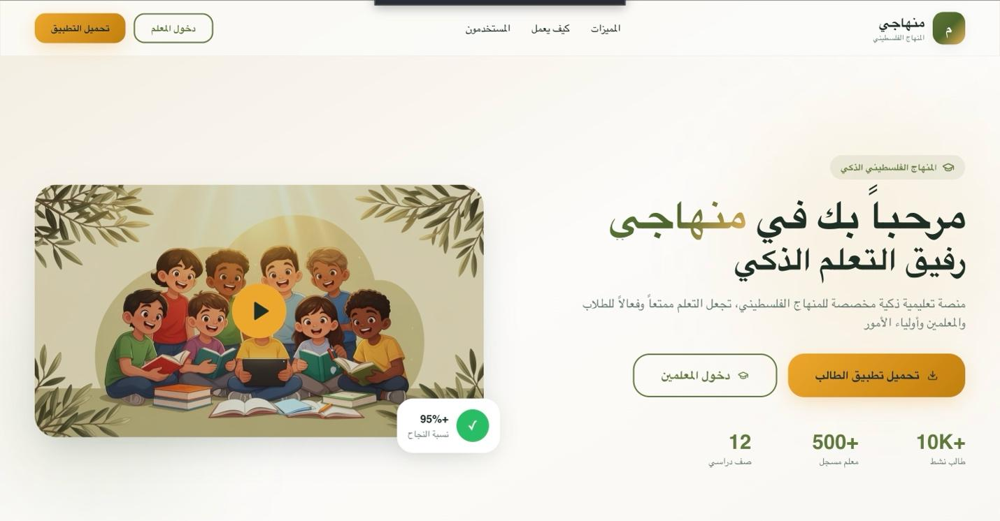
</div>
<p align="center"><em>Figure 4: Manhaji</em></p>


Apps Comparison


The table below shows the comparison between the mentioned websites and apps based


on some features as shown below :


**Table 1: App Comparison**

| Khan Academy<br> / Khanmigo | ABCmouse | LittleLit.ai | Manhaji (Our App) | Key Feature |
|---|---|---|---|---|
| No | No | No | Yes | Curriculum-based learning (textbook-based) |
| No | No | No | Yes | Aligned with local (Palestinian) curriculum |
| No | No | Yes | Yes | Reading practice with voice interaction |
| No | No | Yes | Yes | Automatic speech / reading evaluation |
| Yes | Yes | No | Yes | Self-assessment quiz after each lesson |
| No | No | No | Yes | Quiz generated from lesson questions |
| Yes | Yes | Yes | Yes | Progress tracking over time |
| Yes | No | No | Yes | Teacher access to student progress |
| Limited | Yes | No | Yes | Parent access to progress reports |
| No | No | No | Yes | School-based usage and management |
| No | No | No | Yes | Designed for local educational context |


## 2.3 Tools and Technology


Our system utilizes multiple technologies to serve both mobile and web platforms. The front-end portion of the application serves students and teachers through a functional, interactive user interface, while the back-end is responsible for managing data, users, and learning logic. The technologies chosen were based on their ability to support interactive and curriculum-driven learning while providing the foundation for a scalable and useable application.


- Flutter
- Flutter is a cross-platform application framework that lets developers build from a single codebase apps that run on Android, iOS, and the web. In Manhaji the same Flutter project powers both the students’ mobile app and the teacher/administrator interface, which is simply the same application compiled for the web and served by the backend. Flutter is well-suited to educational apps because it offers rich, child-friendly interface elements that promote student engagement, and using one codebase for every role keeps the product consistent and maintainable. [1]
- Authentication and Security (JWT)
- Access to the system is protected by JSON Web Token (JWT) based authentication with role-based authorization, implemented with Spring Security. Each user (Student, Teacher, Parent, or Administrator) receives a signed token on login that the app sends with every request, and the backend restricts features and data to those permitted for the user’s role. On the device, tokens are held in secure platform storage (Android Keystore / iOS Keychain) rather than plain preferences. [2]


Spring boot


App backend is developed in Spring Boot, which is a Java-based (underlying on Google Spring Framework) software used for creating power-packed and high-performing web applications. Spring Boot is responsible for basic functions like user logins, creating/editing lessons, answering questions, subscribing to more content. Selecting Spring Boot will ensure you have a secure, partitioned and strongly-typed integration and easy access to relational databases and external APIs for your app. Some of its features like support for REST services and dependency injection helps the system to be more maintainable and scalable for long time development pools in developers community. [3]


- MySQL
- The database management system (DBMS) for storing the following information is MySQL: Users; Lessons; Questions; Students' attempts (on lessons); Progress (of students). MySQL contains relational data (as opposed to non-relational), which is more easily and effectively handled using spring boot; therefore, MySQL can provide us with reports on how students are performing in their lessons.[4]
- Artificial Intelligence – Google Gemini
- The platform uses Google’s Gemini 2.5 Flash model as its core AI service. Gemini produces child-friendly explanations of textbook questions, supports generation of practice questions, and also performs speech-to-text transcription of students’ spoken answers. This lets the app simplify content and evaluate spoken responses while keeping the teacher’s role central to the learning process. [5]
- Speech Recognition and Text-to-Speech
- Lessons and questions are read aloud using high-quality neural text-to-speech: Microsoft Edge’s neural voices are used as the primary engine (with Google Cloud Text-to-Speech available as a fallback), covering both Arabic and English. For spoken answers, the students’ recordings are transcribed by Gemini and compared against the expected answer by a pronunciation-scoring routine that tolerates the natural pronunciation differences of young children. Together these give learners pronunciation practice and audio-first interaction, which is especially important in the early grades. [6]


Adaptive Learning – Bayesian Knowledge Tracing


To personalize practice, Manhaji uses Bayesian Knowledge Tracing (BKT), a well-established model that estimates the probability a student has mastered each underlying skill from their sequence of correct and incorrect answers. After every graded quiz the model updates a mastery estimate for each (student, subject, skill), and a personalized “Challenge Me” quiz then targets the skills where the student is weakest. This turns the raw record of answers into an adaptive sequence of questions tailored to each learner.


# Chapter 3: System Analysis and Design


## 3.1 Product Description:


Manhaji is an AIED-based learning system developed for early-grade learners (currently Grades 1–2, with content for higher grades prepared for later release). The product offers interactive, curriculum-based lessons that are accompanied and guided by voice narrations and illustrated images with adaptive questioning to meet the varying educational needs of students.


The platform works by allowing students to listen to lessons and respond verbally, instead of only through reading or writing. Student answers are assessed by AI to judge how well they did, and the difficulty level of the lesson is modified accordingly. Using this information, it creates a personalized learning map for each student.


Manhaji also offers a teacher-facing web-based dashboard that shows real-time analytics, student progress, and skill mastery levels. It should be noted that the system is intended for classrooms as well as homeschooling, yet it is in full accordance with the Palestinian National Curriculum.


#### 3.1.1 System Objectives:


The main objective of Manhaji is to improve early-grade learning by providing personalized and adaptive educational content.


The system aims to:


Support students with limited reading and writing skills through voice-based interaction.


Adjust lesson difficulty based on student performance and learning pace.


Catch learning gaps early and provide targeted practice.


Give teachers clear, actionable performance analytics.


Ensure full alignment with the Palestinian National Curriculum.


#### 3.1.2 System Main Features:


Manhaji includes the following main features:


- Audio explanation for lessons and questions, with the text generated using TTS.
- Speech-based student responses: learners answer by speaking, using voice input and text-to-speech.
- Adaptive questioning: the difficulty of the questions increases or decreases based on the student’s response accuracy and overall behavior during the quiz.
- Tailored learning paths automatically generated from performance tracking.
- Teacher analytics dashboard which includes progress reports, skill-level analysis, and performance trends.
- Parent reporting, providing in-app, AI-generated summaries of each child’s learning outcomes and progress.


#### 3.1.3 Operating Environments


The system operates in many environments:


A mobile app for students, built with Flutter and compatible with Android and iOS devices.


A web interface for teachers and administrators — the same Flutter application compiled for the web and accessed through a browser (not a separate web codebase).


A cloud-based backend that manages data storage, AI processing, and system logic.


An internet connection is required for speech processing, analytics updates, and content synchronization.


#### 3.1.4 Constraints


The system has several constraints:


- AI and speech services are dependent on an internet connection.
• Recognition accuracy can be affected by children's pronunciation and accent.
• Access to devices can be limited, or there may be varying quality of hardware in some learning environments.
• Curriculum edicts require that all teaching must fit official standards.
• Data privacy concerns related to the protection of children and secure data handling.


Ethical Considerations:


Protecting Student Data:


The students’ identities — names, voice recordings of their responses to questions and progress in courses — all need to be private. It secures data and only teachers or staff members with approval can see it.


Stopping Bad, Biased AI Output:


The AI should never ever respond in an unsafe, inappropriate or unfair manner. But educators must vet all AI-generated content to ensure it is free from bias or doesn’t unfairly single out any student.


Adult Oversight:


Teachers and parents need to be able to witness what the student is doing and how the AI is teaching them. No ruling should occur without adult oversight.


Accessibility for All Students:


The model should adapt to a wider range of learning levels. It should employ audio, visuals, basic directions and “adaptive pacing,” meaning a child who struggles at reading is not left struggling throughout.


#### 3.1.5 User Requirements


The Manhaji system is designed to serve multiple user groups, each with distinct needs, expectations, and responsibilities. The user requirements focus on ensuring usability, accessibility, pedagogical effectiveness, and meaningful interaction for all stakeholders involved in the learning process.


**Student Requirements**

- **SR-1** The system will have an easy-to-use child interface, with clear and simple visuals that can be navigated without need for much reading or writing
- **SR-2** The system will deliver lesson content Through audio narration, so that the students can learn through listening instead of being presented with text only material.
- **SR-3** The system will have speech-supported for dialogue between students and it will take questions in the form of speech as the main input .
- **SR-4** The system will incorporate live speech recognition to listen and interpret spoken answers by students in real time .
- **SR-5** The system will also involve immediate feedback following each student's response with audio and/or visual feedback, to reinforce correct responses or direct remediation.
- **SR-6** The system will dynamically modify question difficulty based on student performance, correctness of response, and learning status.
- **SR-7** The system will monitor each student’s incremental learning progress, from lesson completion and accuracy of responses to skill level mastery
- **SR-8** The system will produce individual learning paths, balancing the order of content and practice activities based on each student’s areas of strength and weakness.
- **SR-9** The system will show Feedback about how the learner is making progress in a constructive way that should not discourage young learners .
- **SR-10** The system will allow to pick up right at where they last left off (activity) without losing any of their work or progress.

**Teacher User Requirements**

- **TR-1** Secure Access & Role-Based Permissions Teachers have secured access to the system according to their subscription type
- **TR-2** Lesson & Curriculum Access Teachers must have access to lesson plans that align with the curriculum and questions that relate to those lessons .
- **TR-3** Class & Student Monitoring Teachers will have the ability to see which students they have, view how well those students are doing individually and as a group, and keep track of student progress.
- **TR-4** Assessment Usage & Filtering: Teachers will be able to use questions that relate to their lessons for instruction, and filter those questions by subject, lesson, or type of question.
- **TR-5** Content Protection: Teachers are prohibited from editing or deleting lesson content.

**Admin User Requirements**

- **AR-1** System Administration & Security Administrators are responsible for managing and controlling all aspects of systems including administration, configuration, security and maintenance.
- **AR-2** School Account Provisioning Administrators will create, activate, and manage school accounts and subscriptions, as well as manage subscriptions for independent (non-school affiliated users for activation, billing, and compliance purposes only.
- **AR-3** System Monitoring Administrators will monitor system usage and system performance using system logs for the purpose of providing technical support and monitoring security
- **AR-4** Access Restrictions Administrators do not have access to school operations, educational content, student data or assessment results

**Parent User Requirements**

- **PR-1** Parents will manage their children's data through a parent account on the Student Progress Monitoring System
- **PR-2** Progress Monitoring & Reports Parents can view automated quiz results and AI-generated progress reports for their children inside the app.
- **PR-3** Read-Only Permissions Parents will be able to view student progress only and they will not have the ability to make changes to student data or course content

**School Requirements**

- **SCR-1** Account Creation & Payment Information Enables Schools to set up accounts, pay for school subscriptions, and enter payment information for subscriptions in one place.
- **SCR-2** Add Teachers/Students Enables Schools to create a Teacher account, Student account, and Parent account as well as link a student to a teacher/class.

#### System Requirements


**Functional Requirements**


This section describes the functionalities that Manhaji system expected to provide for realizing its educational goals. Every requirement describes an operation that the system will carry out in reaction to a user action or when a processing demand is made.


**FR-1** User Authentication and Authorization

    - **FR-1.1** The system shall enable users to authenticate in a secure manner.
    - **FR-1.2** The system shall assign access rights according to user roles (Student, Teacher, Admin).
    - **FR-1.3** The system shall limit access to functionality and data based on role.

**FR-2** Student Profile Management

    - **FR-2.1** The system shall generate and also store profiles such that each student has a unique learning profile.
    - **FR-2.2** The system shall maintain students' grade level, learning rate and past performance.
    - **FR-2.3** The system shall automatically restore a learner's state upon login.

**FR-3** Lesson Delivery

    - **FR-3.1** The system shall provide curriculum-aligned lessons at the student’s grade level.
    - **FR-3.2** the Lessons shall be delivered by the system using simultaneous audio narration and visual display.
    - **FR-3.3** The system shall segment lessons to enable gradual learning.

**FR-4** Speech-Based Interaction

    - **FR-4.1** The system shall capture spoken student responses using speech input technology.
    - **FR-4.2** The system shall transcribe the spoken responses into text by way of speech-to-text processing.
    - **FR-4.3** The system shall provide a fallback for interaction methods other than speech input.

**FR-5** Answer Evaluation and Feedback

    - **FR-5.1** The system shall assess student submissions through an artificial intelligence (AI)-based answer-analysis method.
    - **FR-5.2** The system shall determine whether a response is correct, partially correct, or incorrect.
    - **FR-5.3** The system shall support data retrieval for analytics and reporting purposes.

**FR-6** Adaptive Questioning

    - **FR-6.1** A system that shall adapt difficulty of questions based on student performance.
    - **FR-6.2** The system shall continue to administer the next questions based on mastery level and errors.
    - **FR-6.3** The system shall minimize repeated coverage of mastery items and enhance weak areas.

**FR-7** Learning Progress Tracking

    - **FR-7.1** The system  shall log every student response and outcome.
    - **FR-7.2** Reporting shall be at the lesson and skill level.
    - **FR-7.3** Mastery student indicators shall be dynamically updated by the system.

**FR-8** Personalized Learning Path Generation

    - **FR-8.1** The system shall  provide custom paths for learning based on a student’s capabilities.
    - **FR-8.2** The environment shall adjust content sequencing according to continuous evaluation outcomes.
    - **FR-8.3** The system shall include the suggested targeted practice activities to close learning gaps.

**FR-9** Teacher Analytics and Reporting and questions visibility

    - **FR-9.1** Teachers shall have equivalent access to the web-based analytics dashboard.
    - **FR-9.2** The system shall show the progress, performance level (mastery) of a student and analyze trends of users’ performances.
    - **FR-9.3** The system shall support filtering analytics by class, lesson or time period.
    - **FR-9.4** The Teacher shall manage visibility of content based on whether it be showed to student or not.

**FR-10** Parent Progress Reporting

    - **FR-10.1** Information shall be reported in a more simplified and non-technical form.

**FR-11** Administrative Content Management

    - **FR-11.1** The application shall permit administrators to create/edit/approve educational material.
    - **FR-11.2** The solution shall have audit logs for all administrative actions

**FR-12** System Data Management

    - **FR-12.1** The software shall store users' data, lesson material (lessons), and assessment results securely.
    - **FR-12.2** The system shall  be consistent over sessions and devices.
    - **FR-12.3** The system shall be capable of retrieving data for analysis and reporting.

**Non-Functional Requirements**


This section specifies the quality attributes and operational constraints of the Manhaji system. Each requirement is written in a measurable form so that it can be objectively verified during testing.


**NFR-1** Usability

    - **NFR-1.1** A student aged 6–9 shall be able to start a lesson within three taps of logging in, with no text typing required.
    - **NFR-1.2** At least 90% of interactive elements shall be operable through audio and visual cues, without depending on reading.
    - **NFR-1.3** Core actions (open a lesson, answer a question, replay audio) shall each be reachable in two taps or fewer.

**NFR-2** Performance

    - **NFR-2.1** Screen navigation and answer feedback shall complete in under 2 seconds under normal network conditions.
    - **NFR-2.2** Speech transcription and pronunciation scoring shall return a result within the configured timeout of about 12 seconds, and typically faster.
    - **NFR-2.3** The backend shall support at least 500 concurrent active users while keeping non-AI request times under 2 seconds.

**NFR-3** Reliability and Availability

    - **NFR-3.1** The system shall maintain at least 99% uptime during school hours.
    - **NFR-3.2** Progress saved to the server shall not be lost, and an interrupted quiz attempt shall resume from its last saved state.
    - **NFR-3.3** After an unexpected error or restart, the system shall resume the student from their last saved attempt or lesson state.

**NFR-4** Scalability

    - **NFR-4.1** The architecture shall support growth to at least 10,000 registered users and 50 schools without redesign.
    - **NFR-4.2** Backend services shall scale horizontally behind a load balancer.
    - **NFR-4.3** A new question type or subject shall be addable without a database migration or downtime.

**NFR-5** Security

    - **NFR-5.1** Every protected request shall require a valid signed JWT; access tokens expire after 24 hours and refresh tokens after 7 days.
    - **NFR-5.2** Passwords shall be stored only as salted BCrypt hashes, and client–server traffic shall use HTTPS/TLS in production.
    - **NFR-5.3** Every protected endpoint shall enforce role-based authorization, returning HTTP 403 on a violation.

**NFR-6** Privacy

    - **NFR-6.1** A user shall be able to access only the data permitted for their role (for example, a parent sees only their own child).
    - **NFR-6.2** Child data sent to external AI services shall be limited to the minimum needed for scoring (the audio or text of an answer).
    - **NFR-6.3** Each school’s data shall be isolated so that no user can read another school’s records.

**NFR-7** Maintainability

    - **NFR-7.1** The code shall be organised into modular controller/service/repository layers so that a change in one module does not affect the others.
    - **NFR-7.2** The full automated test suite shall run in under 2 minutes to support fast iteration.
    - **NFR-7.3** Adding a new question type shall require changes only in a small, fixed set of well-defined places: a new enum value, a scoring branch, a DTO field, a Flutter model getter, a widget, and a curriculum JSON entry.

**NFR-8** Compatibility

    - **NFR-8.1** The student application shall run on iOS 13.0 and above, and on Android at the minimum SDK provided by the Flutter 3.10 toolchain (which the project does not raise).
    - **NFR-8.2** The teacher and administrator web build shall run on current versions of Chrome, Edge and Firefox.
    - **NFR-8.3** The interface shall render correctly on screen widths from 320 px (small phone) upward.

**NFR-9** Data Integrity

    - **NFR-9.1** All user input shall be validated on the server before storage, and invalid requests shall be rejected with a clear error.
    - **NFR-9.2** AI responses shall be validated as well-formed JSON before they are persisted, so no partial or corrupt record is stored.
    - **NFR-9.3** Each quiz answer shall be recorded exactly once, with its correctness and points.

**NFR-10** Compliance

    - **NFR-10.1** Lesson and question content shall align with the Palestinian National Curriculum for the targeted grade.
    - **NFR-10.2** The work shall comply with Birzeit University graduation-project guidelines.
    - **NFR-10.3** AI-generated content shall be treated as assistive, with the human-reviewed curriculum as the source of truth.

## 3.2 Functional Decomposition (Use Case Diagram)


functional decomposition is used to deconstruct the Manhaji system into its main building blocks and the interactions of users with the system. This section identifies the key actors who interact with the system, and describes a set of use cases which explain how each actor is able to perform certain tasks. Use Case Diagram: The use case model gives a detailed, user-oriented view of system behavior and serves as the basis for detailed systems design and construction.


On the Manhaji platform, the service follows a role-based interaction model, so that the system behavior could be changed keeping the identity (i.e. Student, Teacher, Parent and Administrator) of user in mind. There is a direct assign between each role and the set of duties and system powers being granted, for security, usability and abstraction.


#### 3.2.1 Actors (actor list and description of their roles)

| Actor | role |
|---|---|
| Student | The main group that will use this system is students. Students will be able to log on to the application to view all subjects and lessons provided by their school's curriculum, listen to lesson audiotapes as well as instructions for answering questions, respond to questions (including voice responses), complete self-assessment quizzes, the results of these quizzes, monitor their overall learning progress, and retake quizzes when necessary. This system has been designed for students ranging from grade 1 through grade 4. |
| Parent | Parents serve as the primary contacts for tracking the academic achievements of their children. They can access their children's quiz results and progress reports via email. Some parents have children enrolled at a school that is part of a larger organization; therefore, they may have multiple children (students) attached to their one parent account. Parents are not able to engage with the content directly through the platform. |
| Teacher | Teachers utilize the system as a tool for supporting interactive classroom activities by allowing them to collaborate on subject areas and lessons, have access to curriculum-based question banks, ask questions in class, filter their questions, view the results of student quizzes, and keep track of student performance. The system can be accessed by teachers through their schools' subscription plan or through an individual subscription plan. |
| School | An organization such as a school would be an actor in the system and uses an agent model, which describes how it manages the relationship between its teachers and their students by assigning each student a teacher, providing access to their parents, tracking overall student progress, and maintaining the subscription between the school and the system. |
| Admin | The administrator manages the system, oversees its operation for users/teachers/schools, manages subscriptions for teachers/schools, creates system configurations, and checks overall activity of the system. |


#### 3.2.2 Use Cases


This section outlines the key use cases that are covered by the Manhaji system. Each use case is a full interaction between an actor and the system. The full use case descriptions, such as preconditions, postconditions, main flow and alternative flows are available in the Appendix.


#### UC-1: Student Accesses Lesson Content


**Primary Actor:** Student


**Summary**


The student chooses a lesson that corresponds to their grade and curriculum. The curriculum is presented through audio narration, photos, and pre-school lesson-size bites.


#### UC-2: Student Generates Gamified Quiz


**Primary Actor:** Student


**Secondary Actors:** System (Quiz Generator, Gamification Module)


**Summary**


A user chooses a previous studied lesson, and the platform creates a personalised quiz for the learner. The system automatically generates quiz questions based on the lessons students have chosen, assesses their answers using AI-based evaluation, assign them points according to performance and update learning progress and gamification scores.


#### UC-3: Adaptive Question Selection


**Primary Actor:** System


**Summary**


Based on performance of a student, difficulty level of question varies dynamically and next suitable activity is selected based upon proficiency level of the learner.


#### UC-4: Personalized Learning Path Generation


**Primary Actor:** System


**Summary**


It updates the student’s learning profile and produces a personalized learning path, focusing on weak skills while allowing for progress in previously mastered skills.


#### UC-5: Teacher Views Student Analytics


**Primary Actor:** Teacher


**Summary**


The teacher logs into the analytics dashboard to look at student and class performance, mastery levels, trends in progress and data-driven insights from AI.


#### UC-6: Administrator Manages Educational Content


**Primary Actor:** Administrator


**Summary**


The admin makes, modifies, and checks lessons and questions to maintain academic scope.


#### 3.2.3 Use Cases Diagram


The Use Case Diagram (Figure 5) illustrates the interaction between the system actors and the core functionality of the Manhaji platform. It shows which capabilities of the system are accessed by each actor, and how system-driven use cases (e.g., adaptation or personalization) run independently depending on the student actions.


<div align="center">
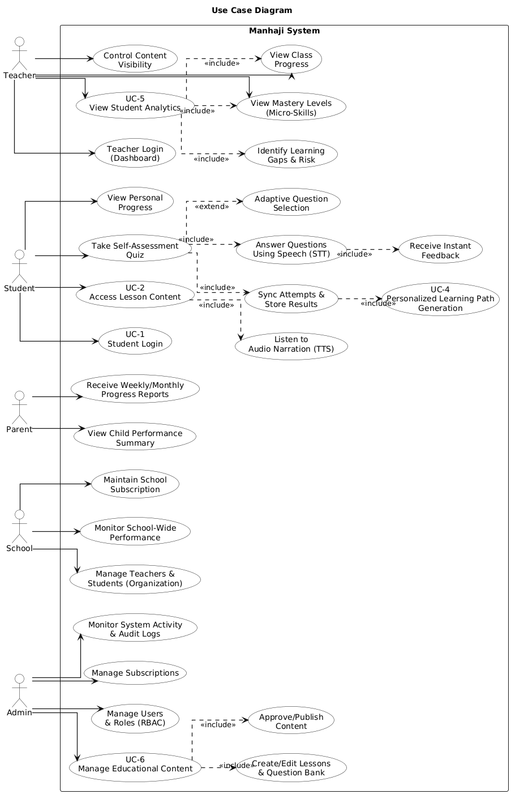
</div>
<p align="center"><em>Figure 5: Use Cases Diagram</em></p>


## 3.3 System Models


System models are used to provide a visual and logical representation of the internal structure and dynamic behavior of the Manhaji system. These models serve to bridge the functional requirements to make them concrete and explain how system components work, how data moves through them, and how users drive system behavior. This section outlines the system design prior to implementation.


The system models in Manhaji include Class Diagrams, Sequence Diagrams, Activity Diagrams, and State Chart Diagrams. Together, these models ensure the soundness, correctness, and coherence of the design.


#### 3.3.1 Class Diagram


The class diagram shows the static structure of the Manhaji system by defining the properties of its main classes, their attributes, methods, and relationships. It provides a structural view of how data is organized.


Key classes in the system include: User, Student, Teacher, Parent, Admin, Lesson, Question, Quiz, Attempt, Progress, and Subscription.


<div align="center">
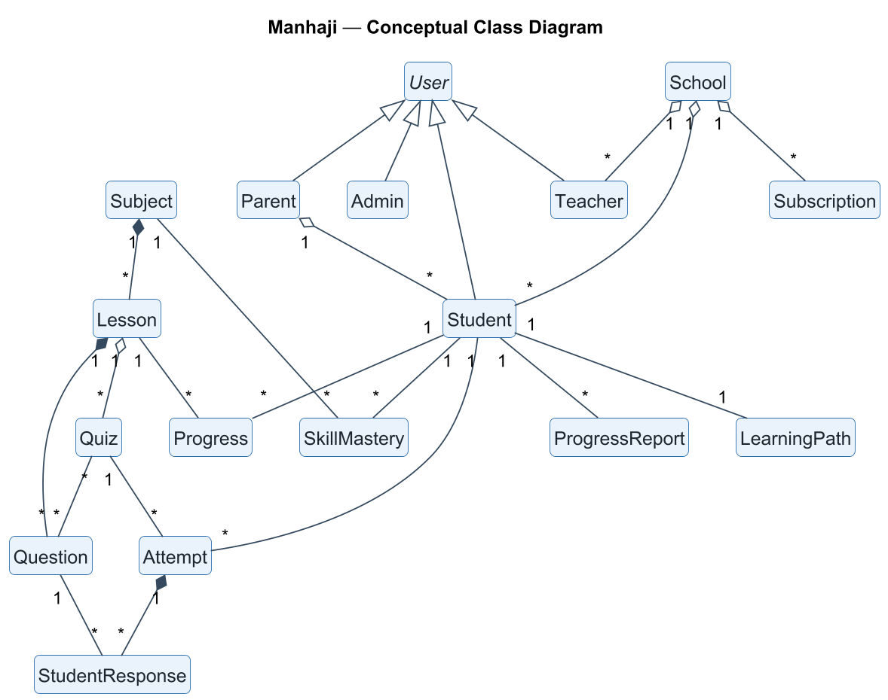
</div>
<p align="center"><em>Figure 6: Conceptual class diagrams</em></p>


<div align="center">
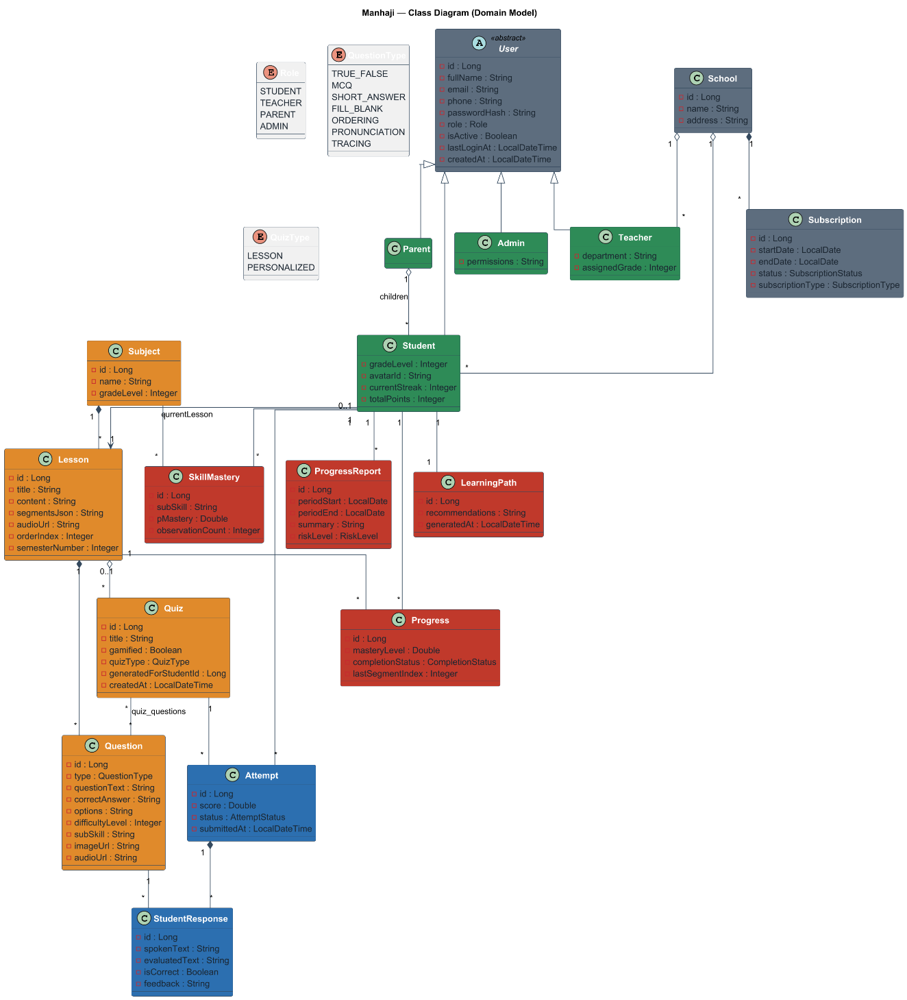
</div>
<p align="center"><em>Figure 7: Class Diagram</em></p>


#### 3.3.2 Sequence Diagram:


Sequence diagrams display interactions between system components in the order they occur to accomplish a particular use case. They care about the flow of messages between actors, user interfaces, system services and backend components.


UC-1: Student Accesses Lesson Content


This process is initiated when a learner logs in to the system and chooses a lesson. It is a network-based solution where the access is validated, then the lesson data is retrieved, and audio narration played and visual content displayed. The conversation is concluded when the completion of the lesson is registered.


UC-2: Student Generates Gamified Quiz


The student chooses from the lessons and asks for a quiz. The system formulates questions, records spoken answers, evaluates answers with AI (artificial intelligence), gives credit for correct answers, tracks progress and stores results.


UC-5: Teacher Views Student Analytics


The teacher logs into the dashboard, asks for analytics information about the students and gets back processed performance metrics, mastery indicators and trend visualizations that have been created by the analytics engine.


UC-1: Student Accesses Lesson Content


<div align="center">
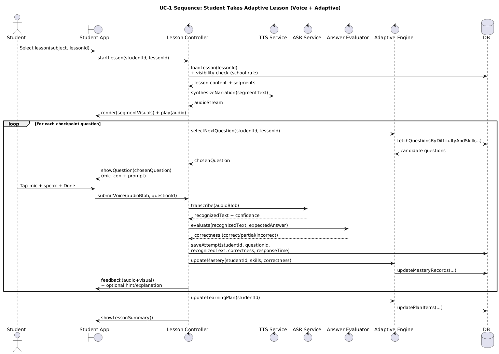
</div>
<p align="center"><em>Figure 8: Sequence Diagram UC-1(Student Accesses Lesson Content)</em></p>


UC-2: Student Generates Gamified Quiz


<div align="center">
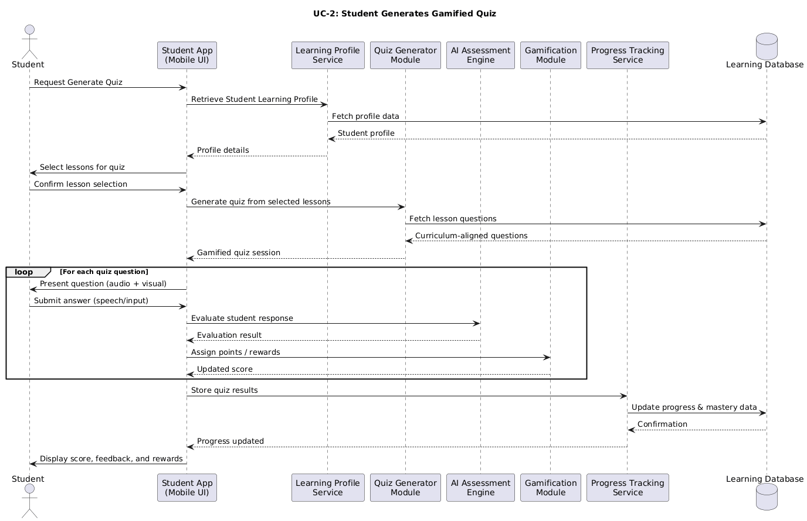
</div>
<p align="center"><em>Figure 9: Sequence Diagram UC-2 (Student Generates Gamified Quiz)</em></p>


UC-5: Teacher Views Student Analytics


<div align="center">
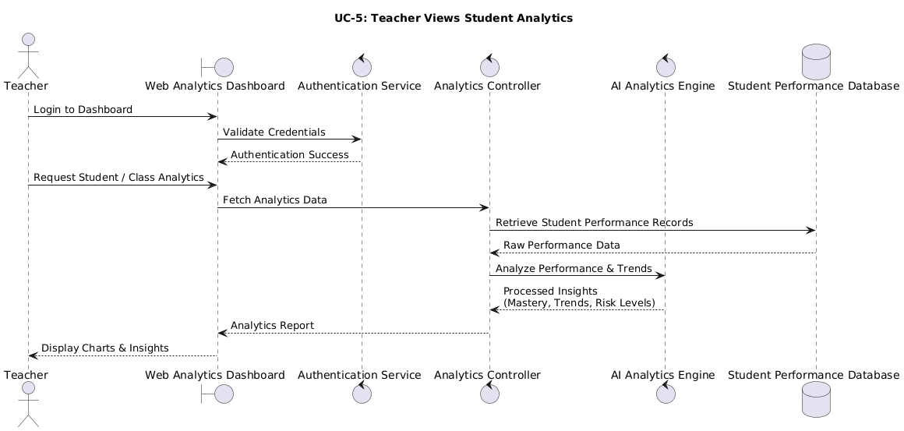
</div>
<p align="center"><em>Figure 10: Sequence Diagram UC-5(Teacher Views Student Analytics)</em></p>


#### 3.3.3 Activity Diagram


Activity diagrams describe the flow of work among the primary functionalities in a system. They depict decision points, parallel actions, system reactions.


- UC-1 Activity Diagram
Illustrates a flow from lesson selection, content playback, student interaction and lesson completion logging.
- UC-2 Activity Diagram
Fig. 1 Depicts the generation of quiz, delivery of question, capturing speech input, evaluating feedback and score as well as progression update.
- UC-5 Activity Diagram
Explains how teachers retrieve analytics, filter data, review results, and leave the dashboard.


UC-1: Student Accesses Lesson Content


<div align="center">
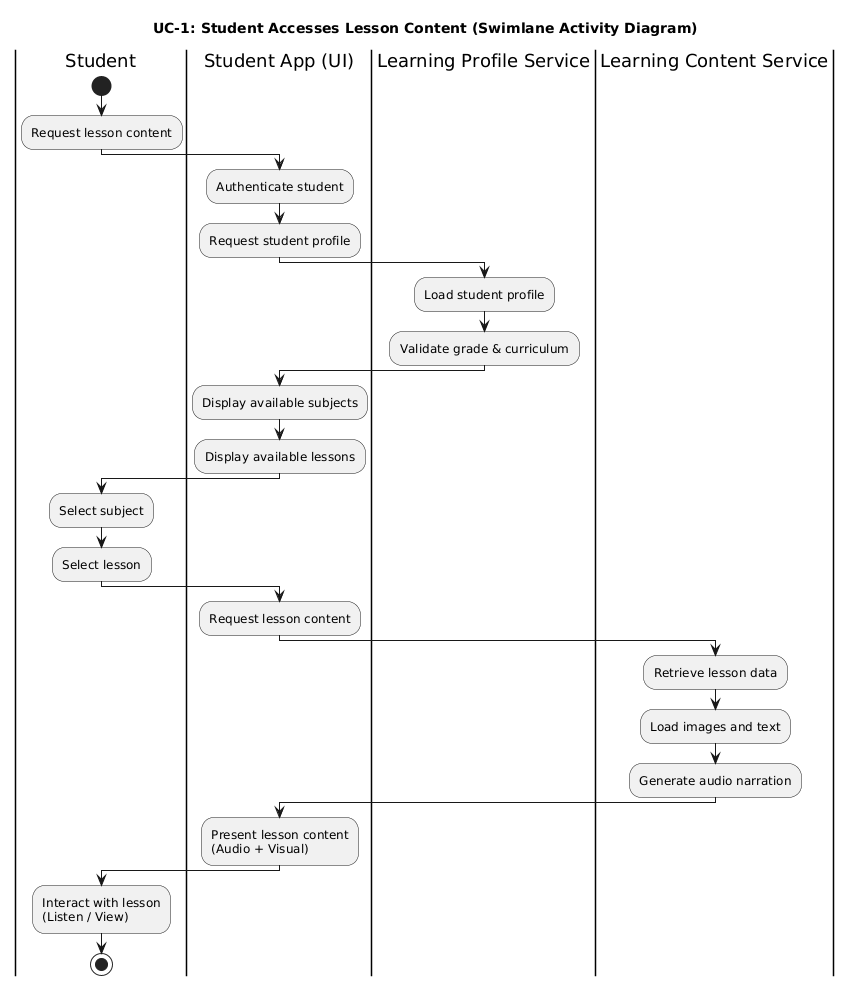
</div>
<p align="center"><em>Figure 11: Activity Diagram UC-1 (Student Accesses Lesson Content)</em></p>


UC-2: Student Generates Gamified Quiz


<div align="center">
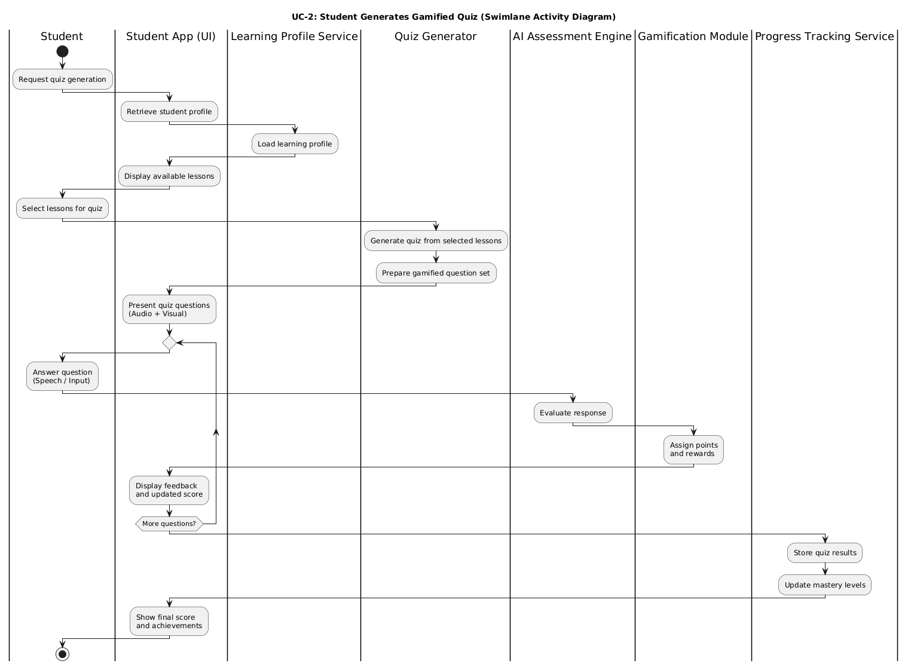
</div>
<p align="center"><em>Figure 12: Activity Diagram UC-2(Student Generates Gamified Quiz)</em></p>


UC-5: Teacher Views Student Analytics


<div align="center">
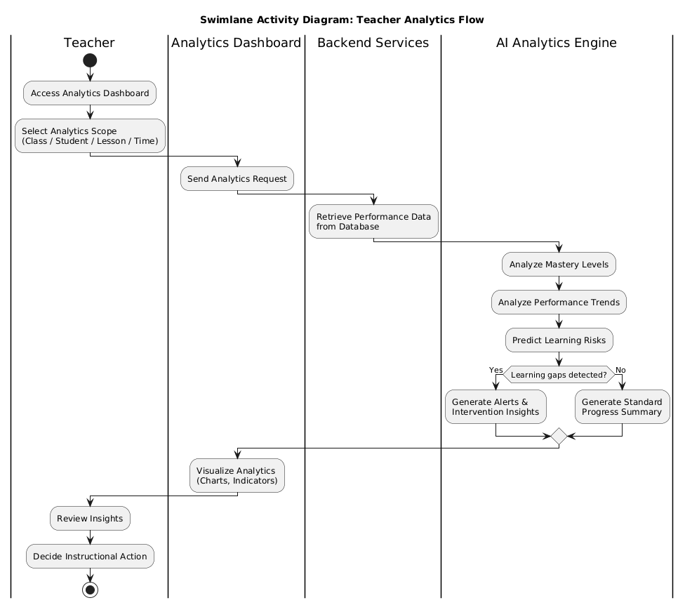
</div>
<p align="center"><em>Figure 13: Activity Diagram UC-5(Teacher Views Student Analytics)</em></p>


#### 3.3.4 State Chart Diagram


State chart diagrams are used to show how system entities transition from one state to another as a result of logic design.


Lesson Session State Chart


A lesson session moves through stages like Idle, Lesson Loaded, Playing Content, Waiting for Response and Complete. Transitions between states are caused by student actions and system events.


Gamified Quiz State Chart


The system moves through various states: Quiz Generated, In Progress, Answer Evaluation, Feedback Granted and Quiz Ended. These transitions keep the quiz flowing at the right pace and ensure each answer is evaluated and scored before the next question is presented.


A) Lesson Session State Chart:


<div align="center">
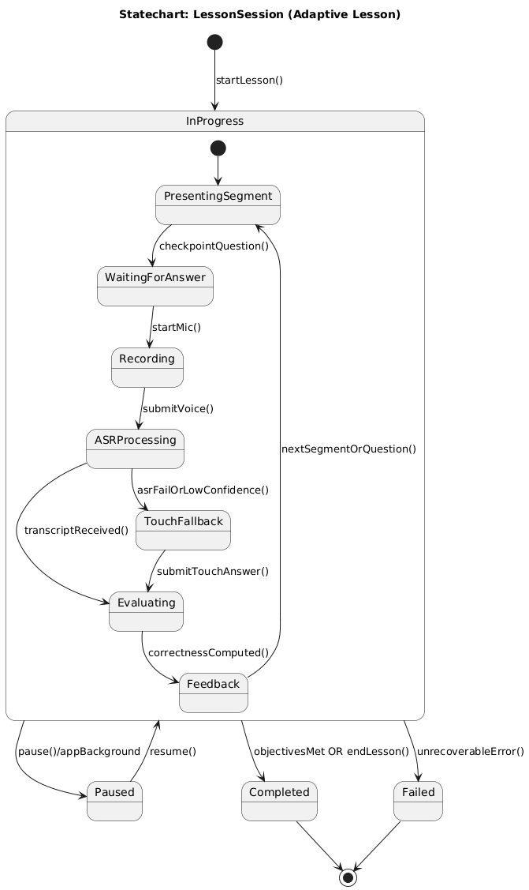
</div>
<p align="center"><em>Figure 14: State Chart Lesson Session</em></p>


B) Gamified Quiz State Chart:


<div align="center">
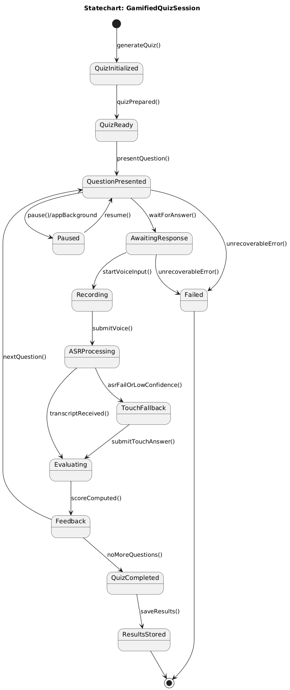
</div>
<p align="center"><em>Figure 15: State Chart Gamified Quiz</em></p>


## 3.4 System Architecture


Manhaji is built on a modular, service-oriented architecture to provide scalability, maintainability and maneuverability. The architecture divides responsibilities into clear decoupled sub-systems, similar to layers in an OSI model; where each layer has strictly dominant functional aspects and communicates with others behind controlled interfaces. This segregation provides the system with both the capability to evolve, and scale, and accommodate new AI features without disturbing existing common functionality.


At a high-level, the system is designed with a client–server architecture, where multiple clients (the student’s mobile app and the teacher’s web-dashboard) are linked to a centralised backend. BackEnd is responsible for data management, AI processing, logic learning and analysis; external voice service and AI services providing intelligent evaluation.


#### 3.4.1 Sub-System


User Management Sub-System


This sub-system governs all user identities and access-control to the whole Manhaji system. It performs user registration, credentials validation, session maintenance and role checks applying to students, teachers, parents, schools and the admin.


Its barrier service protects access, verifies users will only interact with system features and data allowed by their role or subscription level. This sub-system is also responsible for user profiles and restores user states when login again.


Learning Content Sub-System


Curriculum-aligned learning resources are managed by the Learning Content subsystem. It saves lessons, units, textbook-based questions, images and audio narration.


This sub-system presents instructional content to students incorporating simultaneous audio narration and visual materials that enable instruction independent of a heavy reading requirement. Guarantees that we adhere to the Palestinian National Curriculum and helps with teaching in sequence over different periods.


Assessment and Quiz Sub-System


All testing functions (such as test generation, answer submission and evaluation) are performed by the sub-system. It creates quizzes that are created based on lesson and can obtain input from students mainly in spoken form.


The Assessment subsystem interacts with AI services for analyzing the answers spoken, calculating correctness scores and giving instant feedback. It also logs rich trial data to support adaptive learning and progress tracking.


Progress Tracking and Reporting Sub-System


There is also the Progress Tracking sub-system that records on a constant basis student interactions, quiz score results, lessons accomplished, and skill mastery levels. It collects fine-grained learning data to construct long-term performance profiles of each student.


Its features offer progress reports, mastery indicators and automated report cards for teachers and parents. This subsystem is highly responsible for early detection of learning gaps and data-driven educational intervention.


Teacher and Classroom Support Sub-System


Teachers are equipped with analytical devices and classroom-level insights through a web-based dashboard in this subsystem. It provides a way to see performance data for students and classes with both individual skill level tracking as well as skills usage in lessons.


The system also provides a learning data filtering and visualization mechanism that allows teachers to react on the fly to students' performances in order to influence the strategies of their classrooms.


Subscription Management Sub-System


Feature availability by subscription is handled by the Subscription Management sub-system, which is responsible for checking the permissions of schools, teachers, and individual users so that premium features could be limited to entitled accounts. In the current build the subscription and school structures are modeled in the data layer but are not yet enforced as a paywall — all features are available for demonstration.


This sub-system manages licensing business rules while being completely isolated from learning logic.


#### 3.4.2 Software Architecture


The Manhaji architecture is based on layers of software: the presentation layer, the application layer, the intelligence layer, and the data layer.


- Presentation Layer:
Consists of a student mobile application (Flutter-based) and teacher/admin web interface. This is the layer for user interaction, content viewing, audio playback, and voice input.
- Application Layer:
This layer is based on a Spring Boot backend, and it provides a set of RESTful APIs that receive the user request messages, orchestrate learning workflows, apply business rules, and coordinate communication among sub-systems.
- Intelligence Layer:
This layer includes speech-to-text AI service, answer difficulty adjustment, and personalized learning path generation AI services. It processes raw data of interactions into learning insight.
- Data Layer:
Utilizes a relational database to save users, lessons, quizzes, attempts, progress statistics, and subscription details. This layer provides consistency, integrity, and persistence to the data spanned across sessions and devices.
- This layered design enables loose coupling and makes the system maintainable and extendible, which is capable of adopting AI model integration in future.


<div align="center">
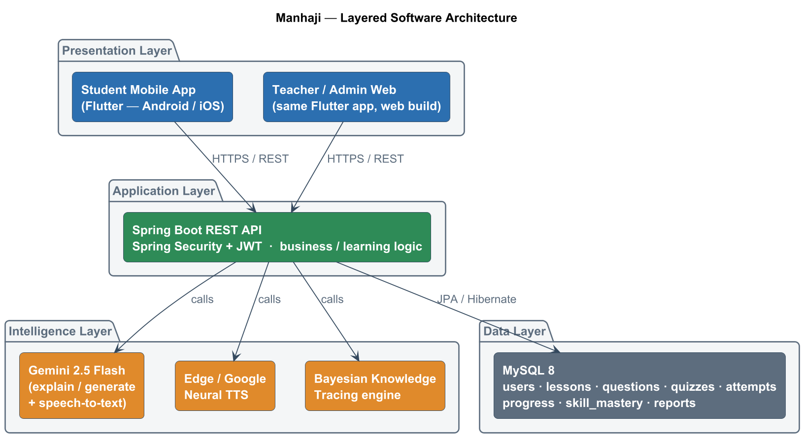
</div>
<p align="center"><em>Figure 16: Software Architecture Diagram</em></p>


#### 3.4.3 Deployment Diagram


Manhaji's deployment architecture is cloud-based and distributed to enable availability and scalability across different nodes.


Devices from students (tailored to work in both Android and iOS) execute the mobile application, sending and receiving data to/from the backend through secured internet connections.


Teachers and administrators use their web browser to log into the system and are looking at the same backend services.


The main system logic is deployed on the backend application server and the API it exposes.


Speech recognition, text-to-speech, and intelligent answer analysis are offloaded to external AI services.


All persistent system data is placed in a centralized database server.


<div align="center">
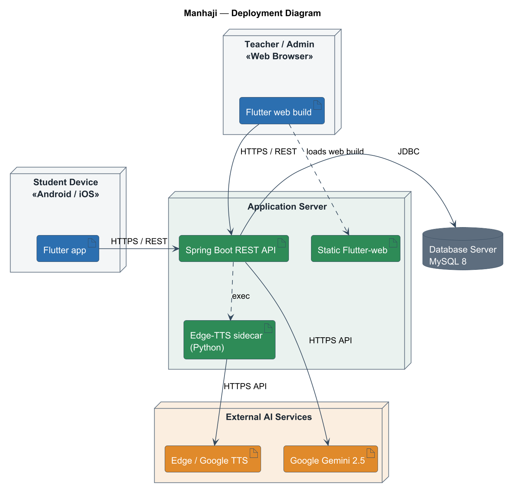
</div>
<p align="center"><em>Figure 17: Deployment Diagram</em></p>


## 3.5 Data Management and ERD


The database is responsible for storing structured educational data, user profiles, test outcomes, progress records and subscription information. We chose a relational model because it is more performant than NoSQL, supports complex relationships between entities and has strong data consistency guarantees in our use case as the model integrates nicely with Spring Boot for backend.


All Data transfers occur via secure backend services, regulated access, role-based visibility restrictions and comply with privacy regulations related to children’s data.


<div align="center">
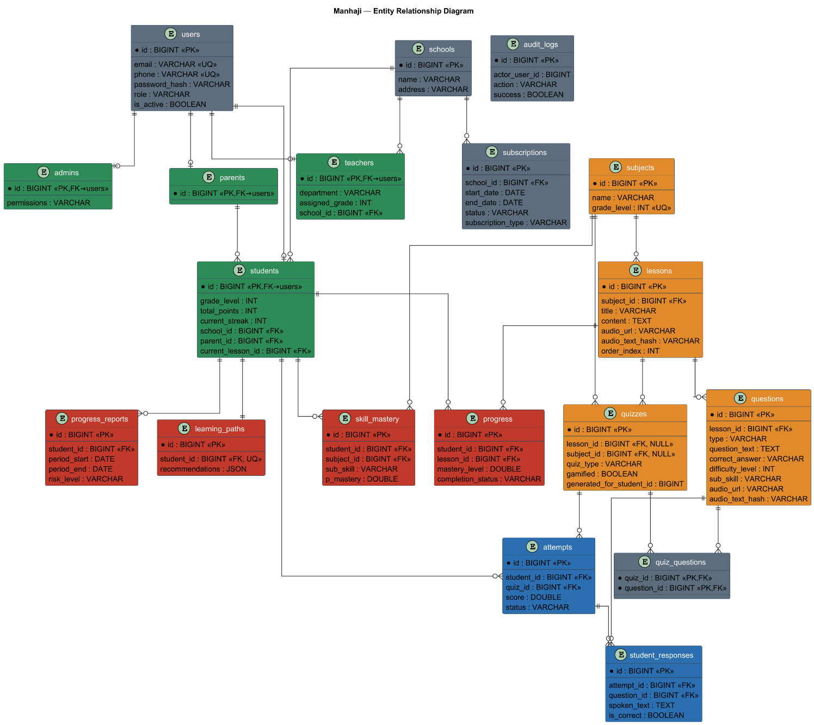
</div>
<p align="center"><em>Figure 18: ERD</em></p>


## 3.6 AI Implementation


Manhaji is an AI-driven system: artificial intelligence is not a single feature but the backbone of four cooperating components. a generative large-language-model layer, a speech-understanding pipeline, a probabilistic learner model, and an adaptive content selector. This section describes each as it is actually implemented in the system. All AI calls are made server-side from the Spring Boot backend and every component is designed to fail soft: if an external model is unavailable, the system falls back to a deterministic path rather than blocking the child.


#### 3.6.1 Generative AI — Large Language Model (Google Gemini)


The generative layer uses Google's Gemini 2.5 Flash large language model, accessed over its REST API. It serves four distinct functions, each driven by a purpose-built, role-primed prompt (the model is instructed to act as a friendly Palestinian first-grade teacher and to answer in Arabic):


(1) free-text answer evaluation, where the model judges whether a child's spoken or typed short answer is semantically correct — tolerating spelling and phrasing variation that exact string matching would reject — and returns a structured verdict;


(2) graded hint generation at three escalating levels (vague cue → targeted cue → near-answer);


(3) natural-language progress-report generation, which summarises a student's performance data into strengths, weaknesses, parent recommendations, and a LOW/MEDIUM/HIGH risk level;


(4) personalised learning-path generation.


To keep outputs deterministic and machine-parseable, generation runs at a low temperature (0.3, and 0.1–0.2 for transcription) with a bounded output-token budget, and the model is constrained to emit JSON only.


The backend defensively strips Markdown code-fences and, if the model returns prose instead of valid JSON, falls back to a keyword heuristic so a malformed response never crashes the evaluation. When no API key is configured, answer checking degrades gracefully to normalized string matching.


#### 3.6.2 Speech Understanding — Transcription and Pronunciation Scoring


The target users are early-grade children who may not yet read or write fluently,


spoken interaction is central. The speech pipeline has three stages.


(1) The child's recorded audio is Base64-encoded and sent to Gemini as an inline multimodal input for speech-to-text transcription (the service class is still named WhisperService for historical reasons, but transcription is performed by Gemini, not OpenAI Whisper).


(2) For pronunciation questions, the model is prompted to return a structured phoneme-level analysis — what the child actually said, the specific Arabic letters or English phonemes mispronounced, and one short Arabic coaching sentence.


(3) The transcription is scored against the expected word by a language-aware algorithm: Arabic text is normalised (diacritics stripped; hamza, taa-marbuta and alif-maqsura variants unified) and English text is reduced to a lightweight Metaphone-style phonetic code (silent letters dropped, interchangeable sounds such as c→k and ph→f mapped, doubled letters collapsed).


The normalised strings are compared with Levenshtein edit distance, converted to a 0–100 similarity score, and mapped to a star rating and child-facing Arabic feedback. This phonetic approach means a six-year-old who says “apple” is credited even when the transcription returns “aple” or “appel.”


Spoken lessons and questions are voiced back to the child through neural text-to-speech (Microsoft Edge voices, with Google Cloud TTS as a fallback).


#### 3.6.3 Learner Modelling — Bayesian Knowledge Tracing


To represent what each student knows, Manhaji implements Bayesian Knowledge Tracing (BKT), the classic knowledge-tracing model of Corbett and Anderson (1995).


BKT treats each (student, subject, sub-skill) cell as a hidden binary variable mastered or not mastered and maintains P(L), the probability the skill is mastered, updating it after every graded answer.


The model has four parameters:


P(L0), the prior mastery of a new student;


P(T), the probability of learning the skill between two practice opportunities;


P(S), the slip probability that a master answers wrong;


P(G), the guess probability that a non-master answers right.


Each observation is processed in two steps.


The Bayesian evidence step computes the posterior given the answer:


for a correct answer:


P(L|correct) = P(L)·(1−P(S)) / [ P(L)·(1−P(S)) + (1−P(L))·P(G) ];


for a wrong answer:


P(L|wrong) = P(L)·P(S) / [ P(L)·P(S) + (1−P(L))·(1−P(G)) ].


The learning-transition step then nudges this posterior upward:


P(L)′ = P(L|obs) + (1−P(L|obs))·P(T).


The deployed parameters are P(L0)=0.30, P(T)=0.15 and P(S)=0.10, with the guess probability made question-type dependent so that weaker evidence moves mastery less:


P(G)=0.25 for four-option multiple-choice,


P(G)=0.50 for true/false


P(G)= 0.10 for fill-in-the-blank


P(G)= 0.05 for open short-answer, ordering, pronunciation and tracing.


A skill is treated as mastered once P(L) reaches 0.95. All parameters are externalised as configuration so they can be recalibrated without recompiling. The per-skill mastery state is what drives the student's “My Skills” visualisation and the adaptive selector below.


#### 3.6.4 Adaptive Content Selection — Personalised Quiz Generation


The BKT model feeds an adaptive question selector that generates the personalised “Challenge Me” quiz. Rather than serving a fixed question order, the selector scores every candidate question in the subject with a weighted heuristic that combines three factors:


## 3.7 Implementation and Evaluation


This chapter reports what was actually built and how the system was verified. Manhaji moved beyond the proposal stage into a working, end-to-end application; the sections below summarise the delivered system, the automated testing performed, a worked example of the knowledge-tracing engine on real data, representative AI outputs, and the user-facing screens.


#### 3.7.1 Development Summary


The system was implemented as a cross-platform Flutter application (compiled for both mobile and the web) backed by a Spring Boot REST service and a MySQL database, with JWT-secured, role-based access for the Student, Teacher, Parent, and Administrator roles. The current build delivers curriculum content for Grades 1 and 2 across four subjects — Arabic, English, Mathematics, and Religious Education — and supports seven question types: multiple-choice, true/false, short-answer, fill-in-the-blank, ordering, spoken pronunciation, and letter tracing. The four AI components described in Section 3.6 (generative evaluation, the speech pipeline, Bayesian Knowledge Tracing, and adaptive selection) are all integrated and operational.


#### 3.7.2 Knowledge-Tracing Walkthrough


To validate the learner model end-to-end, a Grade-2 student account was taken through a ten-question personalized Mathematics quiz. Before the quiz, every Mathematics sub-skill sat at the prior mastery value P(L0) = 0.30 with zero observations. The student answered seven questions correctly and two incorrectly, with one skill (computation) deliberately answered wrong. After the attempt, the Bayesian update had clearly differentiated the skills: consistently-correct skills such as production and recognition rose toward 1.0 (production reached 1.0 and recognition 0.96), partially-practised skills settled in the middle (comprehension 0.62, application 0.55), the deliberately-wrong skill fell to 0.17, and a skill the quiz never touched (handwriting) correctly held at its 0.30 prior. The corresponding mastery rows were persisted and immediately reflected in the student's “My Skills” view. This demonstrates the two BKT behaviours the system depends on: evidence from correct answers raises mastery, evidence from wrong answers lowers it, and unobserved skills are left unchanged.


## 3.8 How Manhaji Builds Its Question Bank from Textbooks


Manhaji's question bank is built using a semi-automated pipeline that combines traditional software engineering techniques with generative AI. The goal is to efficiently convert Palestinian Ministry of Education textbooks into high-quality, curriculum-aligned assessment questions while ensuring every question is reviewed before reaching students.


Rather than relying entirely on manual authoring or fully automated AI generation, the system automates repetitive tasks such as PDF processing and validation, uses AI to generate draft questions, and requires human review before publication.


The pipeline consists of four independent stages:


PDF


│


▼


Stage 1: extract.py


Extract text, chapters, objectives, and images


│


▼


Stage 2: draft.py (Gemini)


Generate draft questions


│


▼


Stage 3: lint.py


Validate against quality rules


│


▼


Stage 4: Human Review


Manual review and final Gradle audit


Each stage is implemented as a separate command-line tool, allowing individual stages to be rerun without repeating the entire process. For example, updating AI-generated questions does not require parsing the PDF again.


The Challenge


Palestinian MoE textbooks are distributed as PDF files, but they are not designed for automated processing. Several issues make direct extraction difficult:


1. The textbooks are written in Arabic (right-to-left).


2. PDF text often contains bidirectional (BiDi) and ligature rendering artifacts.


3. Document structures differ across subjects.


4. Many lessons contain implicit assessment opportunities rather than explicit exercises. For example, a reading passage may require comprehension questions even though none are provided.


Because of these challenges, manually creating approximately twelve high-quality questions for every lesson across multiple grades, subjects, and semesters would have required hundreds of hours of work. To address this, Manhaji uses an AI-assisted workflow while ensuring that every generated question is validated and reviewed before publication.


#### Stage 1 – PDF Parsing and Chapter Extraction


Chapter Detection


The system identifies lesson boundaries using two methods.


Primary Method


If the PDF contains bookmarks or a table of contents, these are used directly to identify chapters.


Fallback Method


If no bookmarks are available, the system scans each page for chapter headings by combining:


the largest text on the page,


Arabic structural keywords such as: Lesson, Unit.


This approach allows chapter extraction even from poorly structured PDFs.


Arabic Text Recovery


Arabic PDFs often store text in reverse order or without proper character shaping. To recover readable text, the extractor:


1. detects reversed Arabic text,


2. reshapes Arabic characters using arabic-reshaper,


3. restores correct reading order using python-bidi,


4. removes unnecessary diacritics,


5. removes tatweel characters,


6. cleans private Unicode glyph artifacts.


These preprocessing steps significantly improve the quality of extracted lesson text.


Chapter Output


For each detected chapter, the extractor produces a structured JSON file containing:


chapter title, chapter order, page range, learning objectives, complete lesson text,


the primary reading passage (identified as the longest paragraph exceeding 120 characters).


This JSON becomes the input for AI question generation.


#### Stage 2 – AI Question Drafting


After extraction, the chapter JSON is passed to Google Gemini 2.5 Flash, the same model used elsewhere in the Manhaji platform.


The AI generates draft assessment questions rather than final content. Several engineering decisions improve output quality.


This ensures the response is valid JSON that can be parsed directly instead of free-form text.


Low Temperature


A temperature of 0.4 is used.


This produces enough variation for natural question wording while maintaining consistent structure across different lessons.


Prompt Design


Each lesson type uses a dedicated prompt template.


The prompt is divided into two parts:


System instruction:


defines formatting rules, specifies the required schema, explains curriculum constraints, describes the assessment sub-skills.


User prompt: contains the extracted chapter text.


This separation improves consistency across generated lessons.


Few-Shot Prompting


Every template includes a complete example of a high-quality lesson that already satisfies all validation rules.


Providing this example significantly reduces formatting errors and prevents the model from producing generic educational content.


Question Schema


Every generated question follows a fixed schema containing:


Question type, Question text, Correct answer,


answer options (where applicable), Difficulty level (1–3), Educational sub-skill


Cost and Performance


Using Gemini 2.5 Flash, generating one lesson typically requires approximately 3–8 seconds.


Generating an entire grade and subject (roughly 80 lessons) completes in about 10 minutes, compared with an estimated 80 hours of manual authoring.


#### Stage 3 – Automated Validation


Immediately after generation, every lesson is checked using a custom Python validation tool (lint.py).


The validator mirrors the Java backend audit so that problems can be detected within seconds rather than waiting for a full Gradle build.


Example validation rules include:


1. MCQ correct answers must appear among the listed options.


2. Multiple-choice questions must contain 3–5 options.


3. Difficulty values must be between 1 and 3.


4. Each lesson must contain at least eight questions.


5. Each lesson must include at least one advanced (difficulty level 3) question.


6. Duplicate questions are not allowed.


7. Every lesson must assess at least three different educational sub-skills.


8. Empty fields, invalid question types, and unknown sub-skills are rejected.


Only lessons that satisfy these structural requirements proceed to human review.


#### Stage 4 – Human Review and Final Audit


Although AI creates the initial draft, no generated content is published directly.


Each lesson undergoes manual review by a human editor, who checks:


After review, the lesson is merged into the official curriculum dataset.


1. chapter title accuracy,


2. remaining Arabic formatting issues,


3. quality of multiple-choice distractors,


3. curriculum alignment,


4. cultural appropriateness,


5. suitability for Palestinian learners,


6. alignment with Islamic values in Religion lessons,


Finally, the backend executes the full Gradle QuestionAuditTest, which performs additional checks that are not included in the lightweight Python validator, including:


1. duplicate detection across the entire curriculum,


2. overall dataset consistency.


Only lessons that successfully pass every audit stage are included in the released application.


# Chapter 4: Testing


This chapter describes the testing performed to evaluate the functionality, correctness and reliability of the Manhaji platform. Testing covered every major subsystem of the application — authentication and access control, multimodal lesson delivery, the ten interactive question types, speech-based pronunciation scoring, letter tracing, the adaptive knowledge-tracing engine, the AI analytics and reporting services, and the teacher and parent dashboards. The results were analysed against the functional requirements defined in Chapter 3.


## 4.1 Testing Methodology


Testing was carried out to confirm that the Manhaji system behaves as specified and satisfies the functional requirements stated in Chapter 3. Three complementary approaches were applied: black-box testing, white-box testing, and automated unit and widget testing.


### 4.1.1 Black-Box Testing


Black-box testing evaluated the system from the user’s perspective through the graphical interface, without reference to the internal implementation. Inputs were supplied through the running application and the observed outputs were compared with the expected results. This approach was applied to:


- Student login, registration and role-based navigation.
- Lesson presentation, narration and segment navigation.
- Answering and scoring across all question types.
- Pronunciation recording and tracing interactions.
- Generation and display of AI performance reports and learning paths.
- Teacher and parent dashboards and analytics.


### 4.1.2 White-Box Testing


White-box testing examined the internal logic of the implemented modules. Emphasis was placed on the decision logic that determines correctness and progression, including:


- Answer-evaluation rules in QuizService for each question type.
- Language-aware pronunciation scoring (Arabic diacritic normalization, English Metaphone-lite, Levenshtein distance).
- The Bayesian Knowledge Tracing update and the personalized question-selection logic.
- JSON parsing and validation of AI responses before persistence to the database.
- JWT issuance, validation and role-based authorization.


### 4.1.3 Automated Unit and Widget Testing


In addition to manual testing, Manhaji maintains an automated test suite that is run on every change. The backend is covered by JUnit 5 and Mockito unit tests (including QuizServiceTest, PronunciationScoringServiceTest and the curriculum QuestionAuditTest, which enforces schema and quality rules across the question bank). The Flutter application is covered by provider and widget tests. The full suite passes consistently, providing a regression-safety net that complements the integration tests described below.


## 4.2 Integration and System Testing


Integration testing verified that the major modules operate correctly together after integration — the Flutter client, the Spring Boot backend, the MySQL database and the AI services. The test cases below are grouped by subsystem. Each case is documented with its identifier, scenario, pre-conditions, the executed steps, and the expected and actual results.


### 4.2.1 Authentication and Access Control


The authentication subsystem was tested to confirm that valid users are admitted, invalid credentials are rejected, and role-based authorization is enforced.

<p class="cap">Table 2: TC-01 – Student Login with Valid Credentials</p>
<table class="tc">
<tr><th>Test Case ID</th><td colspan="2">TC-01</td><th>Test Date</th><td colspan="2">14 Jun 2026</td></tr>
<tr><th>Title</th><td colspan="5">Student Login with Valid Credentials</td></tr>
<tr><th>Scenario</th><td colspan="2">Authentication</td><th>Designed By</th><td colspan="2">Abdallah Mattour</td></tr>
<tr><th>Description</th><td colspan="5">Verify that a registered student can log in with valid credentials and reach the home dashboard.</td></tr>
<tr><th>Pre-conditions</th><td colspan="5">A student account exists. The backend and MySQL database are running. The app is on the login screen.</td></tr>
<tr class="sh"><th>Step</th><th>Step Description</th><th>Expected Result</th><th>Actual Result</th><th>P/F</th><th>Notes</th></tr>
<tr><td class="c">1</td><td>Enter a valid username and password</td><td>Fields accept the input with no validation errors</td><td>As expected</td><td class="c pf">Pass</td><td></td></tr><tr><td class="c">2</td><td>Tap &quot;تسجيل الدخول&quot; (Login)</td><td>Backend authenticates, issues a JWT, and the app stores it securely</td><td>As expected</td><td class="c pf">Pass</td><td></td></tr><tr><td class="c">3</td><td>Observe navigation after login</td><td>The student home dashboard opens, showing the subjects and the &quot;تحدَّ نفسك&quot; personalized-quiz banner</td><td>As expected</td><td class="c pf">Pass</td><td></td></tr>
<tr><th>Final Result</th><td colspan="5" class="pass">PASS</td></tr>
</table>
<p class="cap">Table 3: TC-02 – Login Rejected with Invalid Credentials</p>
<table class="tc">
<tr><th>Test Case ID</th><td colspan="2">TC-02</td><th>Test Date</th><td colspan="2">14 Jun 2026</td></tr>
<tr><th>Title</th><td colspan="5">Login Rejected with Invalid Credentials</td></tr>
<tr><th>Scenario</th><td colspan="2">Authentication</td><th>Designed By</th><td colspan="2">Abdallah Mattour</td></tr>
<tr><th>Description</th><td colspan="5">Verify the system rejects an incorrect password and issues no token.</td></tr>
<tr><th>Pre-conditions</th><td colspan="5">A student account exists. The app is on the login screen.</td></tr>
<tr class="sh"><th>Step</th><th>Step Description</th><th>Expected Result</th><th>Actual Result</th><th>P/F</th><th>Notes</th></tr>
<tr><td class="c">1</td><td>Enter a correct username but a wrong password</td><td>Fields accept the input</td><td>As expected</td><td class="c pf">Pass</td><td></td></tr><tr><td class="c">2</td><td>Tap Login</td><td>Backend returns HTTP 401; the app shows the Arabic error &quot;بيانات الدخول غير صحيحة&quot;; no token is stored</td><td>As expected</td><td class="c pf">Pass</td><td></td></tr><tr><td class="c">3</td><td>Attempt to navigate further</td><td>The user remains on the login screen and cannot reach protected screens</td><td>As expected</td><td class="c pf">Pass</td><td></td></tr>
<tr><th>Final Result</th><td colspan="5" class="pass">PASS</td></tr>
</table>
<p class="cap">Table 4: TC-03 – Role-Based Access Control</p>
<table class="tc">
<tr><th>Test Case ID</th><td colspan="2">TC-03</td><th>Test Date</th><td colspan="2">15 Jun 2026</td></tr>
<tr><th>Title</th><td colspan="5">Role-Based Access Control</td></tr>
<tr><th>Scenario</th><td colspan="2">Authorization</td><th>Designed By</th><td colspan="2">Yaqeen Azamta</td></tr>
<tr><th>Description</th><td colspan="5">Verify a STUDENT token cannot access teacher-only resources.</td></tr>
<tr><th>Pre-conditions</th><td colspan="5">Logged in as a STUDENT with a valid token.</td></tr>
<tr class="sh"><th>Step</th><th>Step Description</th><th>Expected Result</th><th>Actual Result</th><th>P/F</th><th>Notes</th></tr>
<tr><td class="c">1</td><td>Request a teacher analytics endpoint using the student token</td><td>The backend authorization layer rejects the request with HTTP 403 Forbidden</td><td>As expected</td><td class="c pf">Pass</td><td></td></tr><tr><td class="c">2</td><td>Check UI gating</td><td>The teacher dashboard is not reachable from the student application</td><td>As expected</td><td class="c pf">Pass</td><td></td></tr>
<tr><th>Final Result</th><td colspan="5" class="pass">PASS</td></tr>
</table>

### 4.2.2 Lesson Delivery


The lesson subsystem was tested to confirm that multimodal content is presented, narrated and navigated correctly, and that completion is recorded.

<p class="cap">Table 5: TC-04 – Multimodal Lesson Delivery and Narration</p>
<table class="tc">
<tr><th>Test Case ID</th><td colspan="2">TC-04</td><th>Test Date</th><td colspan="2">15 Jun 2026</td></tr>
<tr><th>Title</th><td colspan="5">Multimodal Lesson Delivery and Narration</td></tr>
<tr><th>Scenario</th><td colspan="2">Lesson Delivery</td><th>Designed By</th><td colspan="2">Basel Bahbouh</td></tr>
<tr><th>Description</th><td colspan="5">Verify a lesson renders text and illustrations, narrates via text-to-speech, and supports navigation and completion tracking.</td></tr>
<tr><th>Pre-conditions</th><td colspan="5">Student is logged in. A published lesson exists for the selected subject.</td></tr>
<tr class="sh"><th>Step</th><th>Step Description</th><th>Expected Result</th><th>Actual Result</th><th>P/F</th><th>Notes</th></tr>
<tr><td class="c">1</td><td>Open a subject and select a lesson</td><td>The lesson content (text and illustrations) loads correctly</td><td>As expected</td><td class="c pf">Pass</td><td></td></tr><tr><td class="c">2</td><td>Start narration (speaker button)</td><td>The TTS service narrates the lesson in Arabic using the Cairo-style neural voice</td><td>As expected</td><td class="c pf">Pass</td><td>First playback has a brief (~1 s) delay while the audio is fetched; instant on replay (cached).</td></tr><tr><td class="c">3</td><td>Use the next / previous / replay controls</td><td>Navigation moves between lesson segments and audio re-queues to the current segment</td><td>As expected</td><td class="c pf">Pass</td><td></td></tr><tr><td class="c">4</td><td>Reach the final segment</td><td>The lesson is marked complete and progress is persisted to the database</td><td>As expected</td><td class="c pf">Pass</td><td></td></tr>
<tr><th>Final Result</th><td colspan="5" class="pass">PASS</td></tr>
</table>

### 4.2.3 Quiz Answering and Scoring


The quiz subsystem was tested across representative question types to confirm correct evaluation, feedback and retry handling.

<p class="cap">Table 6: TC-05 – Multiple-Choice Scoring and Retry Logic</p>
<table class="tc">
<tr><th>Test Case ID</th><td colspan="2">TC-05</td><th>Test Date</th><td colspan="2">16 Jun 2026</td></tr>
<tr><th>Title</th><td colspan="5">Multiple-Choice Scoring and Retry Logic</td></tr>
<tr><th>Scenario</th><td colspan="2">Quiz Answering</td><th>Designed By</th><td colspan="2">Abdallah Mattour</td></tr>
<tr><th>Description</th><td colspan="5">Verify MCQ scoring, the shake-on-wrong feedback, and the single re-queue retry that awards reduced stars.</td></tr>
<tr><th>Pre-conditions</th><td colspan="5">The student is in an active quiz attempt with a multiple-choice question.</td></tr>
<tr class="sh"><th>Step</th><th>Step Description</th><th>Expected Result</th><th>Actual Result</th><th>P/F</th><th>Notes</th></tr>
<tr><td class="c">1</td><td>Select an incorrect option</td><td>The option shakes; feedback marks it incorrect and highlights the correct answer</td><td>As expected</td><td class="c pf">Pass</td><td></td></tr><tr><td class="c">2</td><td>Continue the quiz</td><td>The wrong question is re-queued once and reappears in the retry pass</td><td>As expected</td><td class="c pf">Pass</td><td></td></tr><tr><td class="c">3</td><td>Select the correct option on the retry</td><td>Marked correct; a maximum of one star is awarded on the second pass</td><td>As expected</td><td class="c pf">Pass</td><td></td></tr><tr><td class="c">4</td><td>Inspect score and progress</td><td>pointsEarned and the progress indicator update correctly</td><td>As expected</td><td class="c pf">Pass</td><td></td></tr>
<tr><th>Final Result</th><td colspan="5" class="pass">PASS</td></tr>
</table>
<p class="cap">Table 7: TC-06 – True / False Question in Arabic (RTL)</p>
<table class="tc">
<tr><th>Test Case ID</th><td colspan="2">TC-06</td><th>Test Date</th><td colspan="2">16 Jun 2026</td></tr>
<tr><th>Title</th><td colspan="5">True / False Question in Arabic (RTL)</td></tr>
<tr><th>Scenario</th><td colspan="2">Quiz Answering</td><th>Designed By</th><td colspan="2">Yaqeen Azamta</td></tr>
<tr><th>Description</th><td colspan="5">Verify Arabic true/false renders صح / خطأ with correct right-to-left layout and scores correctly.</td></tr>
<tr><th>Pre-conditions</th><td colspan="5">An active quiz attempt with an Arabic true/false question.</td></tr>
<tr class="sh"><th>Step</th><th>Step Description</th><th>Expected Result</th><th>Actual Result</th><th>P/F</th><th>Notes</th></tr>
<tr><td class="c">1</td><td>Open the question</td><td>The stem displays right-to-left; options render as صح / خطأ</td><td>As expected</td><td class="c pf">Pass</td><td></td></tr><tr><td class="c">2</td><td>Select the correct option</td><td>Marked correct with haptic feedback and the sliding feedback panel</td><td>As expected</td><td class="c pf">Pass</td><td></td></tr>
<tr><th>Final Result</th><td colspan="5" class="pass">PASS</td></tr>
</table>
<p class="cap">Table 8: TC-07 – Fill-in-the-Blank Answer Evaluation</p>
<table class="tc">
<tr><th>Test Case ID</th><td colspan="2">TC-07</td><th>Test Date</th><td colspan="2">16 Jun 2026</td></tr>
<tr><th>Title</th><td colspan="5">Fill-in-the-Blank Answer Evaluation</td></tr>
<tr><th>Scenario</th><td colspan="2">Quiz Answering</td><th>Designed By</th><td colspan="2">Basel Bahbouh</td></tr>
<tr><th>Description</th><td colspan="5">Verify fill-in-the-blank accepts the expected answer with diacritic/whitespace tolerance and scores correctly.</td></tr>
<tr><th>Pre-conditions</th><td colspan="5">An active quiz attempt with a fill-in-the-blank question.</td></tr>
<tr class="sh"><th>Step</th><th>Step Description</th><th>Expected Result</th><th>Actual Result</th><th>P/F</th><th>Notes</th></tr>
<tr><td class="c">1</td><td>Type the expected word into the blank</td><td>The input field accepts the text</td><td>As expected</td><td class="c pf">Pass</td><td></td></tr><tr><td class="c">2</td><td>Submit the answer</td><td>The normalized comparison (diacritic-insensitive) marks the answer correct</td><td>As expected</td><td class="c pf">Pass</td><td></td></tr>
<tr><th>Final Result</th><td colspan="5" class="pass">PASS</td></tr>
</table>
<p class="cap">Table 9: TC-08 – Ordering Question Sequence Check</p>
<table class="tc">
<tr><th>Test Case ID</th><td colspan="2">TC-08</td><th>Test Date</th><td colspan="2">17 Jun 2026</td></tr>
<tr><th>Title</th><td colspan="5">Ordering Question Sequence Check</td></tr>
<tr><th>Scenario</th><td colspan="2">Quiz Answering</td><th>Designed By</th><td colspan="2">Abdallah Mattour</td></tr>
<tr><th>Description</th><td colspan="5">Verify an ordering question scores correct only when the full sequence matches.</td></tr>
<tr><th>Pre-conditions</th><td colspan="5">An active quiz attempt with an ordering question.</td></tr>
<tr class="sh"><th>Step</th><th>Step Description</th><th>Expected Result</th><th>Actual Result</th><th>P/F</th><th>Notes</th></tr>
<tr><td class="c">1</td><td>Arrange the tokens into a wrong order and submit</td><td>The answer is marked incorrect</td><td>As expected</td><td class="c pf">Pass</td><td></td></tr><tr><td class="c">2</td><td>Arrange the tokens into the correct order and submit</td><td>The answer is marked correct</td><td>As expected</td><td class="c pf">Pass</td><td></td></tr>
<tr><th>Final Result</th><td colspan="5" class="pass">PASS</td></tr>
</table>
<p class="cap">Table 10: TC-09 – Image-Based Multiple Choice (Picture Options)</p>
<table class="tc">
<tr><th>Test Case ID</th><td colspan="2">TC-09</td><th>Test Date</th><td colspan="2">17 Jun 2026</td></tr>
<tr><th>Title</th><td colspan="5">Image-Based Multiple Choice (Picture Options)</td></tr>
<tr><th>Scenario</th><td colspan="2">Quiz Answering</td><th>Designed By</th><td colspan="2">Yaqeen Azamta</td></tr>
<tr><th>Description</th><td colspan="5">Verify the picture-option question renders bundled OpenMoji images and reuses MCQ scoring.</td></tr>
<tr><th>Pre-conditions</th><td colspan="5">An active quiz attempt with an Image-MCQ question (e.g., &quot;Which one is the lion?&quot;).</td></tr>
<tr class="sh"><th>Step</th><th>Step Description</th><th>Expected Result</th><th>Actual Result</th><th>P/F</th><th>Notes</th></tr>
<tr><td class="c">1</td><td>Open the Image-MCQ question</td><td>Four picture options render (cat, dog, lion, elephant)</td><td>As expected</td><td class="c pf">Pass</td><td></td></tr><tr><td class="c">2</td><td>Tap the lion picture</td><td>Marked correct; scoring path is identical to standard MCQ</td><td>As expected</td><td class="c pf">Pass</td><td></td></tr>
<tr><th>Final Result</th><td colspan="5" class="pass">PASS</td></tr>
</table>

### 4.2.4 Speech and Handwriting Assessment


The speech and handwriting subsystems were tested to confirm that spoken answers are scored, tracing is captured and scored, and the system degrades gracefully when AI services are unavailable.

<p class="cap">Table 11: TC-10 – Pronunciation Scoring with Graceful Fallback</p>
<table class="tc">
<tr><th>Test Case ID</th><td colspan="2">TC-10</td><th>Test Date</th><td colspan="2">18 Jun 2026</td></tr>
<tr><th>Title</th><td colspan="5">Pronunciation Scoring with Graceful Fallback</td></tr>
<tr><th>Scenario</th><td colspan="2">Speech Assessment</td><th>Designed By</th><td colspan="2">Abdallah Mattour</td></tr>
<tr><th>Description</th><td colspan="5">Verify a spoken word is transcribed and scored, returns a rating and stars, and degrades gracefully when the AI key is absent.</td></tr>
<tr><th>Pre-conditions</th><td colspan="5">GEMINI_API_KEY is configured. A pronunciation question (e.g., &quot;رمان&quot;) is shown.</td></tr>
<tr class="sh"><th>Step</th><th>Step Description</th><th>Expected Result</th><th>Actual Result</th><th>P/F</th><th>Notes</th></tr>
<tr><td class="c">1</td><td>Tap record and pronounce the word</td><td>Audio is captured and a processing spinner is shown</td><td>As expected</td><td class="c pf">Pass</td><td></td></tr><tr><td class="c">2</td><td>Backend transcribes and scores</td><td>Gemini transcribes; the language-aware scorer (Levenshtein on normalized text) returns a 0–100 score and an Arabic rating (ممتاز / جيد ...)</td><td>As expected</td><td class="c pf">Pass</td><td></td></tr><tr><td class="c">3</td><td>Observe the result</td><td>Stars and feedback are shown; isCorrect is true when score ≥ 60</td><td>As expected</td><td class="c pf">Pass</td><td>Scores vary slightly with microphone quality and background noise; the score-≥60 threshold keeps young learners from being penalised for minor mispronunciations.</td></tr><tr><td class="c">4</td><td>Repeat with the AI key unset</td><td>A friendly &quot;خدمة النطق غير متاحة الآن&quot; message is returned with no crash and no DB write</td><td>As expected</td><td class="c pf">Pass</td><td></td></tr>
<tr><th>Final Result</th><td colspan="5" class="pass">PASS</td></tr>
</table>
<p class="cap">Table 12: TC-11 – Letter Tracing Capture and Scoring</p>
<table class="tc">
<tr><th>Test Case ID</th><td colspan="2">TC-11</td><th>Test Date</th><td colspan="2">18 Jun 2026</td></tr>
<tr><th>Title</th><td colspan="5">Letter Tracing Capture and Scoring</td></tr>
<tr><th>Scenario</th><td colspan="2">Handwriting Assessment</td><th>Designed By</th><td colspan="2">Basel Bahbouh</td></tr>
<tr><th>Description</th><td colspan="5">Verify the tracing canvas captures strokes and produces a heuristic score, stars and rating.</td></tr>
<tr><th>Pre-conditions</th><td colspan="5">An active quiz attempt with a letter-tracing question.</td></tr>
<tr class="sh"><th>Step</th><th>Step Description</th><th>Expected Result</th><th>Actual Result</th><th>P/F</th><th>Notes</th></tr>
<tr><td class="c">1</td><td>Trace the target letter on the canvas</td><td>User strokes render in orange over the faint blue template letter</td><td>As expected</td><td class="c pf">Pass</td><td></td></tr><tr><td class="c">2</td><td>Submit the tracing</td><td>The heuristic (bounding-box extent, point count, stroke count) yields a score mapped to stars and a rating</td><td>As expected</td><td class="c pf">Pass</td><td>The on-device heuristic is intentionally lenient (no ML model, so the app stays offline-capable); very fast or very short strokes can under-score.</td></tr>
<tr><th>Final Result</th><td colspan="5" class="pass">PASS</td></tr>
</table>

### 4.2.5 Adaptive Learning and Knowledge Tracing


The adaptive engine was tested to confirm that mastery estimates update from student answers and that personalized quizzes target the weakest skills.

<p class="cap">Table 13: TC-12 – Knowledge Tracing and Personalized &quot;Challenge Me&quot; Quiz</p>
<table class="tc">
<tr><th>Test Case ID</th><td colspan="2">TC-12</td><th>Test Date</th><td colspan="2">19 Jun 2026</td></tr>
<tr><th>Title</th><td colspan="5">Knowledge Tracing and Personalized &quot;Challenge Me&quot; Quiz</td></tr>
<tr><th>Scenario</th><td colspan="2">Adaptive Learning</td><th>Designed By</th><td colspan="2">Abdallah Mattour</td></tr>
<tr><th>Description</th><td colspan="5">Verify Bayesian Knowledge Tracing updates skill mastery after answers and that the personalized quiz targets the weakest sub-skills.</td></tr>
<tr><th>Pre-conditions</th><td colspan="5">The student has answered several questions across multiple sub-skills.</td></tr>
<tr class="sh"><th>Step</th><th>Step Description</th><th>Expected Result</th><th>Actual Result</th><th>P/F</th><th>Notes</th></tr>
<tr><td class="c">1</td><td>Answer questions correctly and incorrectly across skills</td><td>StudentResponse rows are stored and each sub-skill mastery P(L) is updated by the BKT engine</td><td>As expected</td><td class="c pf">Pass</td><td></td></tr><tr><td class="c">2</td><td>Open &quot;تحدَّ نفسك&quot; (Challenge Me)</td><td>A personalized quiz is assembled from the lowest-mastery sub-skills</td><td>As expected</td><td class="c pf">Pass</td><td></td></tr><tr><td class="c">3</td><td>Inspect the selected questions</td><td>The items concentrate on the weak skills with mixed difficulty</td><td>As expected</td><td class="c pf">Pass</td><td></td></tr>
<tr><th>Final Result</th><td colspan="5" class="pass">PASS</td></tr>
</table>

### 4.2.6 AI Analytics and Reporting


The AI reporting subsystem was tested to confirm that performance reports and learning paths are generated, parsed and persisted correctly.

<p class="cap">Table 14: TC-13 – AI Performance Report Generation</p>
<table class="tc">
<tr><th>Test Case ID</th><td colspan="2">TC-13</td><th>Test Date</th><td colspan="2">19 Jun 2026</td></tr>
<tr><th>Title</th><td colspan="5">AI Performance Report Generation</td></tr>
<tr><th>Scenario</th><td colspan="2">AI Reporting</td><th>Designed By</th><td colspan="2">Basel Bahbouh</td></tr>
<tr><th>Description</th><td colspan="5">Verify &quot;تقرير الأداء&quot; produces a structured Arabic report with real numbers from the student’s data, and that an early rendering defect is resolved.</td></tr>
<tr><th>Pre-conditions</th><td colspan="5">The student has accumulated attempts and responses. GEMINI_API_KEY is configured.</td></tr>
<tr class="sh"><th>Step</th><th>Step Description</th><th>Expected Result</th><th>Actual Result</th><th>P/F</th><th>Notes</th></tr>
<tr><td class="c">1</td><td>Open Progress → AI Reports → generate the performance report</td><td>The request completes and a report is produced</td><td>As expected</td><td class="c pf">Pass</td><td></td></tr><tr><td class="c">2</td><td>Observe the rendered report (first execution)</td><td>A clean report: metric tiles, per-subject bars and a complete Arabic narrative</td><td>The literal words &quot;json&quot; and &quot;summary&quot; appeared in the output and the Arabic narrative was cut off</td><td class="c pf-fail">Fail</td><td>Defect D-01: the model wrapped its output in ```json fences and the 1024-token limit truncated the Arabic text.</td></tr><tr><td class="c">3</td><td>Re-test after fix</td><td>The report renders fully — no wrapper text and no truncation</td><td>As expected</td><td class="c pf">Pass</td><td>Fixed by requesting JSON mode, stripping markdown fences, and raising the output budget to 2048 tokens. D-01 closed.</td></tr>
<tr><th>Final Result</th><td colspan="5" class="pass">PASS (after fixing defect D-01)</td></tr>
</table>
<p class="cap">Table 15: TC-14 – Personalized Learning-Path Generation</p>
<table class="tc">
<tr><th>Test Case ID</th><td colspan="2">TC-14</td><th>Test Date</th><td colspan="2">20 Jun 2026</td></tr>
<tr><th>Title</th><td colspan="5">Personalized Learning-Path Generation</td></tr>
<tr><th>Scenario</th><td colspan="2">AI Reporting</td><th>Designed By</th><td colspan="2">Yaqeen Azamta</td></tr>
<tr><th>Description</th><td colspan="5">Verify the personalized learning plan is generated and persisted without database JSON errors.</td></tr>
<tr><th>Pre-conditions</th><td colspan="5">The student has performance history. GEMINI_API_KEY is configured.</td></tr>
<tr class="sh"><th>Step</th><th>Step Description</th><th>Expected Result</th><th>Actual Result</th><th>P/F</th><th>Notes</th></tr>
<tr><td class="c">1</td><td>Tap &quot;إنشاء خطة تعلم مخصصة&quot;</td><td>Gemini returns recommendations that are validated as well-formed JSON before persistence</td><td>As expected</td><td class="c pf">Pass</td><td></td></tr><tr><td class="c">2</td><td>Confirm persistence and display</td><td>The plan is stored in the JSON column with no truncation error and renders to the user</td><td>As expected</td><td class="c pf">Pass</td><td></td></tr>
<tr><th>Final Result</th><td colspan="5" class="pass">PASS</td></tr>
</table>

### 4.2.7 Teacher and Parent Dashboards


The teacher and parent subsystems were tested to confirm that analytics and progress summaries are presented to the correct actors.

<p class="cap">Table 16: TC-15 – Teacher Analytics Dashboard</p>
<table class="tc">
<tr><th>Test Case ID</th><td colspan="2">TC-15</td><th>Test Date</th><td colspan="2">20 Jun 2026</td></tr>
<tr><th>Title</th><td colspan="5">Teacher Analytics Dashboard</td></tr>
<tr><th>Scenario</th><td colspan="2">Teacher Dashboard</td><th>Designed By</th><td colspan="2">Yaqeen Azamta</td></tr>
<tr><th>Description</th><td colspan="5">Verify a teacher can view the class roster, per-student progress and weak-skill analytics.</td></tr>
<tr><th>Pre-conditions</th><td colspan="5">Logged in as a TEACHER who owns a class with enrolled students.</td></tr>
<tr class="sh"><th>Step</th><th>Step Description</th><th>Expected Result</th><th>Actual Result</th><th>P/F</th><th>Notes</th></tr>
<tr><td class="c">1</td><td>Open the teacher dashboard</td><td>The class list and summary analytics load correctly</td><td>As expected</td><td class="c pf">Pass</td><td></td></tr><tr><td class="c">2</td><td>Open a student’s detail view</td><td>Per-skill mastery and recent attempts are displayed</td><td>As expected</td><td class="c pf">Pass</td><td></td></tr>
<tr><th>Final Result</th><td colspan="5" class="pass">PASS</td></tr>
</table>
<p class="cap">Table 17: TC-16 – Parent Progress Report</p>
<table class="tc">
<tr><th>Test Case ID</th><td colspan="2">TC-16</td><th>Test Date</th><td colspan="2">20 Jun 2026</td></tr>
<tr><th>Title</th><td colspan="5">Parent Progress Report</td></tr>
<tr><th>Scenario</th><td colspan="2">Parent Dashboard</td><th>Designed By</th><td colspan="2">Basel Bahbouh</td></tr>
<tr><th>Description</th><td colspan="5">Verify a parent can view their child’s structured progress summary.</td></tr>
<tr><th>Pre-conditions</th><td colspan="5">Logged in as a PARENT account linked to a child.</td></tr>
<tr class="sh"><th>Step</th><th>Step Description</th><th>Expected Result</th><th>Actual Result</th><th>P/F</th><th>Notes</th></tr>
<tr><td class="c">1</td><td>Open the parent dashboard</td><td>The child summary (overall progress and recent activity) loads</td><td>As expected</td><td class="c pf">Pass</td><td></td></tr><tr><td class="c">2</td><td>Open the child progress detail</td><td>The subject and sub-skill breakdown is displayed</td><td>As expected</td><td class="c pf">Pass</td><td></td></tr>
<tr><th>Final Result</th><td colspan="5" class="pass">PASS</td></tr>
</table>

## 4.3 Testing Results and Analysis


A total of sixteen integration test cases were executed across the seven subsystems of the Manhaji platform, covering the most important functionality of the system. Fifteen cases passed on the first execution. One case, TC-13 (AI performance report), initially failed: the model output was wrapped in markdown code fences and the Arabic narrative was truncated by a low token limit. The defect (D-01) was corrected by switching the response handling to JSON mode, stripping the fences, and raising the output budget, after which the report rendered correctly on re-test — so all sixteen cases ultimately pass. In addition, the automated test suites — the JUnit 5 / Mockito backend suite and the 41 Flutter provider and widget tests — pass in full, so the integration results are backed by repeatable, automated coverage.


The authentication subsystem correctly admitted valid users, rejected invalid credentials and enforced role-based access. Lesson delivery presented multimodal content with reliable narration and navigation. The quiz subsystem evaluated every tested question type correctly, including the right-to-left Arabic questions and the new image-based questions, and applied the retry-and-reward logic as designed. The speech and handwriting subsystems produced consistent scores and, importantly, degraded gracefully to a friendly message when the AI key was absent, avoiding any crash. The adaptive engine updated mastery estimates and assembled personalized quizzes focused on weak skills, and the AI reporting subsystem generated well-structured Arabic reports and valid, persistable learning plans.


Overall, the testing confirms that the Manhaji platform meets its functional requirements. Where functionality depends on external AI services, the system was verified to behave robustly when those services are unavailable, which is essential for a reliable classroom and demonstration setting.


# Chapter 5: Implementation and UI


This chapter describes how the design presented in Chapter 3 was realised as a working system, and presents the user interface of the delivered application. Manhaji is implemented as a client–server system: a cross-platform Flutter application for students, teachers and parents, communicating over a REST API with a Spring Boot backend that integrates a MySQL database and a set of AI services for generation, speech understanding and text-to-speech. The implementation emphasises a clean layered architecture, an Arabic-first right-to-left interface, and robust behaviour when external AI services are unavailable.


## 5.1 Implementation Overview


The backend is built with Spring Boot (Java 17) and follows a standard layered architecture of controllers, services and repositories, with JPA/Hibernate persistence to MySQL and stateless JWT authentication. Business logic is organised by domain (authentication, lessons, quizzes, progress, reporting, and the teacher, parent and admin modules), with a dedicated package for the AI services. The client is built with Flutter and uses the Provider pattern for state management, the Dio HTTP client for REST and multipart calls, and packages for audio playback, voice recording and charting. All Arabic content is rendered right-to-left using the Cairo font family.


At runtime, the student application authenticates against the backend, loads curriculum-aligned lessons and questions, narrates content through text-to-speech, captures answers (including spoken and traced answers), and submits them for evaluation. The backend scores each answer, updates the learner model, and feeds the adaptive engine that assembles personalized quizzes. Performance data is summarised into AI-generated reports and learning paths for students and parents, and into analytics dashboards for teachers.


## 5.2 System Implementation


The Manhaji system is organised into clearly separated modules so that each part can be developed, tested and extended independently. The main elements of the implementation are described below.


### 5.2.1 Project Structure


The repository is divided into a Spring Boot backend and a Flutter application. The simplified structure of each is shown below.


```java
backend/  (Spring Boot, Java 17)
   controller/   REST controllers: Auth, Lesson, Quiz, Progress, ProgressReport, Teacher, Parent, Admin, Audio
   service/      Business logic + ai/ (Gemini, Whisper, TTS, PronunciationScoring, BKT engine) + storage/
   entity/       JPA entities + enums/ (QuestionType, Role, AttemptStatus ...)
   dto/          request/ and response/ data-transfer objects
   repository/   Spring Data JPA repositories
   config/       Security, JWT, CORS; DataSeeder loads the curriculum JSON on startup
   resources/    application.yaml + curriculum/*.json (Arabic, English, Math, Religion)
manhaji_app/  (Flutter, Provider)
   models/       quiz, lesson, pronunciation_score, report ...
   providers/    auth, learning, lesson, teacher, parent, admin, progress, report
   screens/      splash, auth, home, subject, learning, progress, question_bank, teacher, parent, admin, settings
   services/     api, audio, auth, tts, quiz, report, local_storage
   widgets/      question_widgets/ (mcq, true_false, fill_blank, ordering, short_answer, pronunciation, tracing,
                 image_mcq, listen_choose, image_match) and shared UI widgets
   app/theme.dart   centralised theme (colors, typography, motion)
```


The same structure is shown visually below: the backend package layout and the Flutter application layout.


<div align="center">
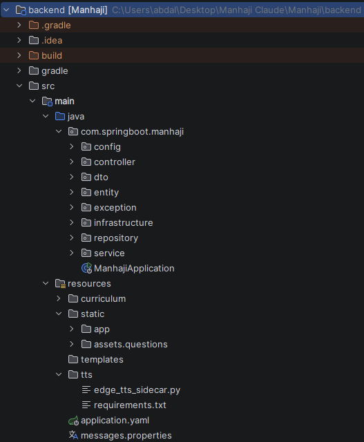
</div>
<p align="center"><em>Figure 19: Backend (Spring Boot) project structure.</em></p>


<div align="center">
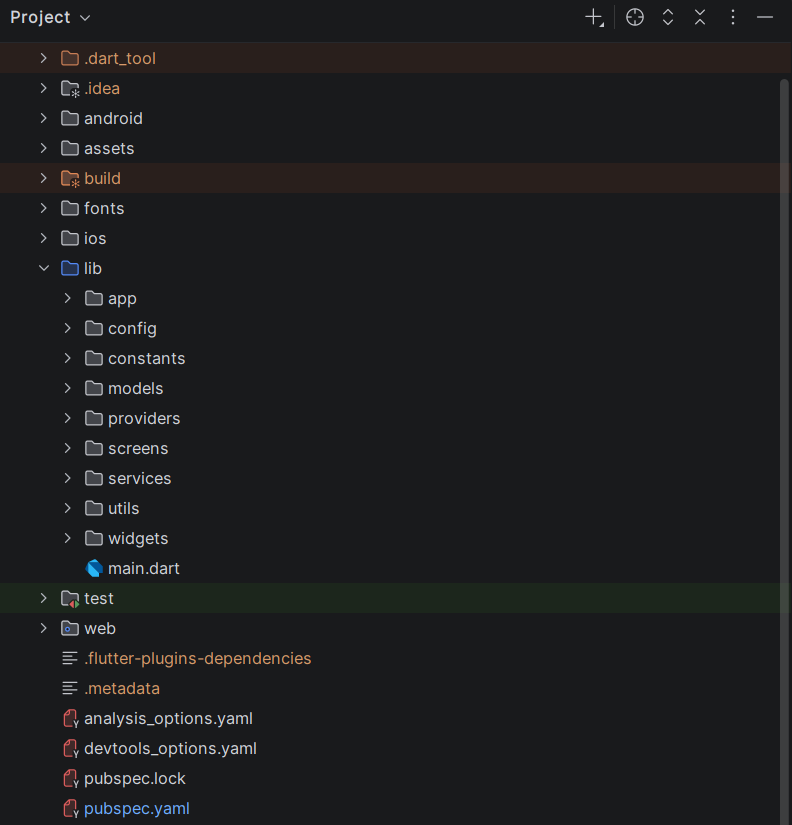
</div>
<p align="center"><em>Figure 20: Frontend (Flutter) project structure.</em></p>


### 5.2.2 Backend Implementation


Each REST controller exposes a focused set of endpoints and delegates to a service that contains the business logic, which in turn uses repositories for persistence. A quiz attempt is modelled by an Attempt entity (IN_PROGRESS / COMPLETED) and per-question StudentResponse records that store correctness and points earned. QuizService exposes the submit, pronunciation and tracing flows and dispatches answer evaluation by question type, so new types are added as new enum values and evaluation branches without disturbing existing flows. Authentication is stateless: a signed JWT is issued on login and validated on each request, and authorization is enforced by role (STUDENT, PARENT, TEACHER, ADMIN).


Answers are scored by question type. Each type maps to one branch in QuizService.evaluateAnswer, so a new question type is added by inserting one branch without touching the others:


```java
if (type == QuestionType.TRUE_FALSE)
    return canonicalTrueFalse(correct).equals(canonicalTrueFalse(student));
if (type == QuestionType.MCQ || type == QuestionType.IMAGE_MCQ
        || type == QuestionType.LISTEN_CHOOSE)
    return correct.equalsIgnoreCase(student);
if (type == QuestionType.IMAGE_MATCH)
    return matchPairsEqual(correct, student);     // order-independent pairing
if (type == QuestionType.FILL_BLANK || type == QuestionType.ORDERING)
    return normalizeArabic(correct).equals(normalizeArabic(student));
```


### 5.2.3 Adaptive Learning Engine


The adaptive core is implemented by the BKT engine, the skill-mastery service and the quiz-selection service. After each answer, the engine applies the Bayesian Knowledge Tracing update to revise the probability that the student has mastered the targeted sub-skill, using the prior, transition, slip and (type-dependent) guess parameters described in Chapter 3. The quiz-selection service then uses these mastery estimates to assemble the personalized "Challenge Me" quiz, concentrating questions on the sub-skills with the lowest mastery while mixing difficulty levels to keep the experience achievable.


The core of the adaptive engine is the Bayesian Knowledge Tracing update. After every answer it revises the belief that the student has mastered the targeted skill, first by conditioning on whether the answer was correct (the slip and guess parameters), then by applying the learning-transition step:


```java
// Bayesian Knowledge Tracing: update P(mastered) after one answer
public double update(double pL, boolean correct, double guess) {
    double slip = cfg.getPSlip(), transit = cfg.getPTransit();
    double num, den;
    if (correct) {                      // P(mastered | correct)
        num = pL * (1 - slip);
        den = pL * (1 - slip) + (1 - pL) * guess;
    } else {                            // P(mastered | wrong)
        num = pL * slip;
        den = pL * slip + (1 - pL) * (1 - guess);
    }
    double posterior = num / den;
    return clamp(posterior + (1 - posterior) * transit);  // learning step
}
```


### 5.2.4 AI Services Integration


The AI services are isolated in a dedicated package so the rest of the system depends only on their interfaces. The Gemini service performs answer evaluation, hint generation, transcription and report/plan generation; JSON-mode requests are used for structured outputs, and responses are validated before being persisted to the JSON columns. The pronunciation-scoring service is language-aware: it normalises Arabic (stripping diacritics and unifying letter forms) or applies an English phonetic encoding, then computes a similarity score using Levenshtein distance. The text-to-speech service narrates lessons and questions using neural voices with a fallback provider. Every AI call is guarded so that a missing key or a service error produces a friendly message rather than a failure.


Pronunciation is scored by comparing the expected word with the transcription returned by the speech service. The scorer is language-aware — it normalises Arabic or applies an English phonetic encoding — and then measures similarity with Levenshtein distance, so a young learner is not penalised for a minor mispronunciation:


```java
// Language-aware pronunciation score (0..100)
public int score(String expected, String transcribed, String language) {
    String lang = (language != null) ? language : detectLanguage(expected); // Arabic block U+0600..06FF
    String a = normalize(expected, lang);    // ar: strip diacritics/unify hamza; en: Metaphone-lite
    String b = normalize(transcribed, lang);
    if (a.equals(b)) return 100;
    int dist = levenshtein(a, b);
    int sim  = (int) Math.round((1.0 - (double) dist / Math.max(a.length(), b.length())) * 100);
    return Math.max(0, Math.min(100, sim));
}
```


### 5.2.5 Frontend Implementation


The Flutter client renders each question type with a dedicated widget under question_widgets, while the learning screen dispatches on the question type and owns the attempt flow (introduction, question, feedback and retry). Widgets are stateless with respect to scoring — they raise callbacks and receive answered/correct state from the provider — which keeps the scoring authority on the backend. The interface is child-focused: large tappable targets, haptic feedback, shake-on-wrong animation, per-question audio, and a consistent warm theme defined centrally in the theme file. All Arabic text is laid out right-to-left.


On the client, a single dispatch method maps each question type to its widget. The widgets are stateless with respect to scoring — each one raises a callback with the chosen answer and is told whether it was correct — which keeps the scoring authority on the backend and makes adding a new type a one-line change here:


```java
// learning_screen: dispatch each question type to its dedicated widget
Widget _buildAnswerArea(LearningProvider provider, Question q) {
  if (q.isPronunciation) return PronunciationWidget(question: q, ...);
  if (q.isTracing)       return TracingWidget(question: q, ...);
  if (q.isMCQ)           return McqWidget(question: q, onSelect: _select, ...);
  if (q.isImageMcq)      return ImageMcqWidget(question: q, onSelect: _select, ...);
  if (q.isListenChoose)  return ListenChooseWidget(question: q, onReplay: _speak, ...);
  if (q.isImageMatch)    return ImageMatchWidget(question: q, onChanged: _select, ...);
  if (q.isTrueFalse)     return TrueFalseWidget(question: q, onSelect: _select, ...);
  if (q.isFillBlank)     return FillBlankWidget(question: q, onChanged: _select, ...);
  if (q.isOrdering)      return OrderingWidget(question: q, onOrderChanged: _select, ...);
  return ShortAnswerWidget(...);   // default: written / spoken answer
}
```


### 5.2.6 Curriculum Seeding


Curriculum content is authored as JSON files (one per subject and part) and loaded into the database on startup by the DataSeeder, which reads each question’s type generically. Adding a new question type therefore requires only a new enum value, any needed scoring wiring, the seed JSON entries and a matching Flutter widget. A non-destructive backfill path adds newly authored questions to existing lessons without wiping the database, which makes iterative content work safe during development and demonstrations.


Each question is a small JSON object. A picture-based question simply adds an "optionImages" array next to the usual options, so authoring new content needs no code changes:


```java
{
  "type": "IMAGE_MCQ",
  "questionText": "Which one is the lion?",
  "correctAnswer": "Lion",
  "options": ["Cat", "Dog", "Lion", "Elephant"],
  "optionImages": ["assets/openmoji/cat.png", "assets/openmoji/dog.png",
                   "assets/openmoji/lion.png", "assets/openmoji/elephant.png"],
  "difficultyLevel": 1,
  "subSkill": "recognition"
}
```


### 5.2.7 Database Implementation


Manhaji persists its data in MySQL 8 through JPA/Hibernate, with the schema created and kept up to date automatically from the entity classes (ddl-auto = update). User accounts use JPA joined-table inheritance: a base users table holds the shared fields and the students, teachers, parents and admins tables extend it. The main tables are summarised below.


**Table 18: Key database tables**

| Table | Purpose |
|---|---|
| users (+ students / teachers / parents / admins) | Accounts and roles, modelled with joined-table inheritance. |
| subjects / lessons / questions | Curriculum content organised by subject, grade and lesson. |
| quizzes | Standard and personalized ("Challenge Me") quizzes. |
| attempts / student_responses | A student’s run through a quiz, and each individual answer with its correctness and points. |
| progress / skill_mastery | Lesson completion and per-sub-skill Bayesian mastery estimates. |
| progress_reports / learning_paths | AI-generated performance reports and personalized learning plans. |
| schools / subscriptions | School accounts and their subscription records. |


A few columns store structured data as JSON so that flexible content needs no schema change: questions.option_images and questions.pairs_json hold the picture options and matching pairs for the image-based question types, learning_paths.recommendations holds the AI-generated plan, and the progress report stores its detail payload as JSON. Keeping these as JSON leaves the relational schema stable while still allowing new question types and richer AI output to be added without database migrations.


## 5.3 User Interface


This section presents the user interface of the delivered application through screenshots taken from the running system. The screens follow a consistent Arabic-first, child-friendly visual language with a warm palette, large controls and clear feedback. Each screen is shown below with a short explanation of what it does and what to notice in it.


### 5.3.1 Splash and Login


When the application starts, a branded splash screen is shown and is followed by the login screen. Students sign in with their credentials; the form and all of its labels are presented in Arabic with a right-to-left layout.


<div align="center">
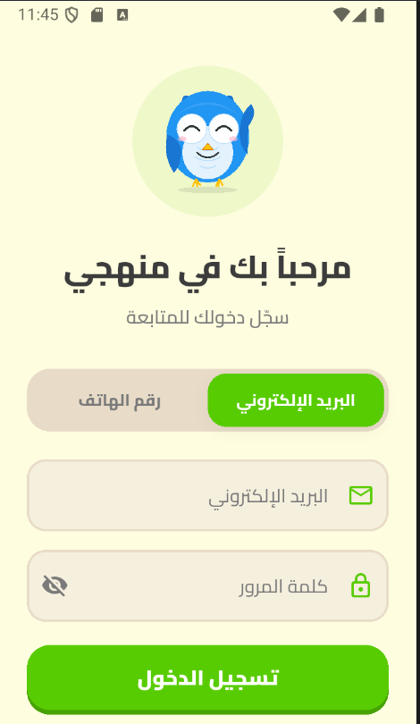
</div>
<p align="center"><em>Figure 21: Splash screen and student login.</em></p>


### 5.3.2 Student Home Dashboard


After signing in, the student arrives at the home dashboard. It presents the available subjects as large, colourful cards and highlights the personalized "Challenge Me" (تحدَّ نفسك) quiz that targets the learner’s weakest skills.


<div align="center">
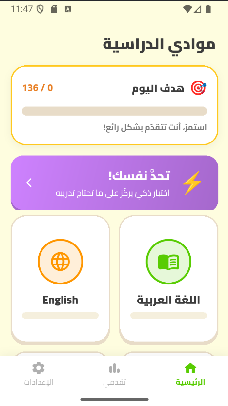
</div>
<p align="center"><em>Figure 22: Student home dashboard with subjects and the Challenge-Me banner.</em></p>


### 5.3.3 Subject and Lessons


Selecting a subject opens its list of curriculum-aligned lessons. Each lesson shows its title and progress, so the student can see what has been completed and what comes next.


<div align="center">
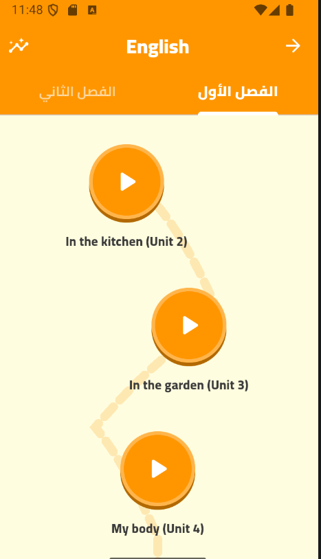
</div>
<p align="center"><em>Figure 23: Subject screen listing its lessons.</em></p>


### 5.3.4 Lesson View


A lesson is presented in a multimodal way — short text, illustrations and audio narration — so early-grade learners can follow it by listening even before they read fluently. Playback controls let the student replay the narration at any time.


<div align="center">
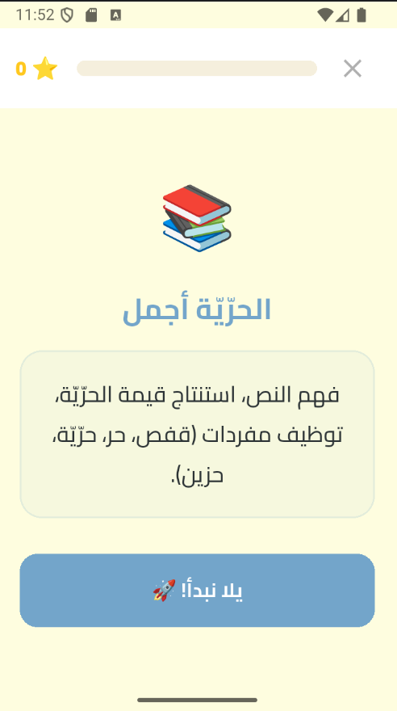
</div>
<p align="center"><em>Figure 24: Lesson view with narration and illustrated content.</em></p>


### 5.3.5 Quiz and Question Types


During a quiz, each question is shown with large answer options and immediate feedback. The interface supports many question types (multiple-choice, true/false, fill-in-the-blank, ordering, picture-based, pronunciation and tracing) and displays the running score and progress as the student advances.


<div align="center">
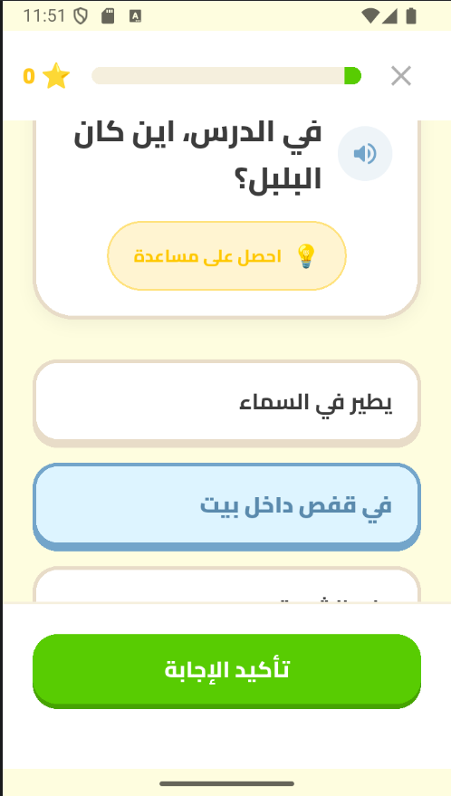
</div>
<p align="center"><em>Figure 25: Answering a question during a quiz.</em></p>


### 5.3.6 Pronunciation and Tracing


Two specialised question types support literacy. A pronunciation question records the student’s voice and scores how closely it matches the target word, while a tracing question lets the student draw a letter on a canvas and scores the handwriting.


<div align="center">
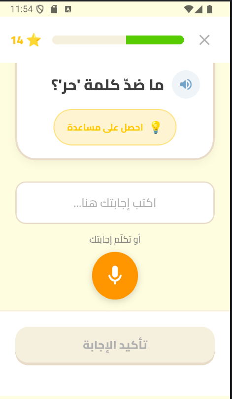
</div>
<p align="center"><em>Figure 26: Pronunciation (voice) and letter-tracing questions.</em></p>


### 5.3.7 AI Performance Report


The performance report (تقرير الأداء) is generated by the AI from the student’s real activity. It summarises the results with clear numbers and a short Arabic narrative describing strengths and the areas to improve.


<div align="center">
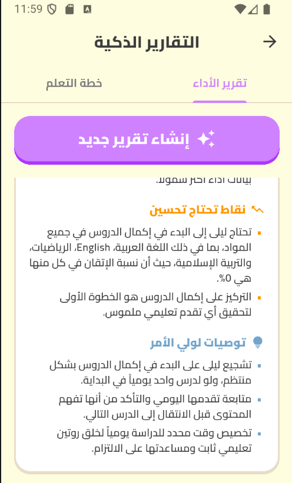
</div>
<p align="center"><em>Figure 27: AI-generated performance report.</em></p>


### 5.3.8 Leaderboard


To keep learning motivating, a gamified leaderboard ranks students by the points they earn from correct answers and completed lessons.


<div align="center">
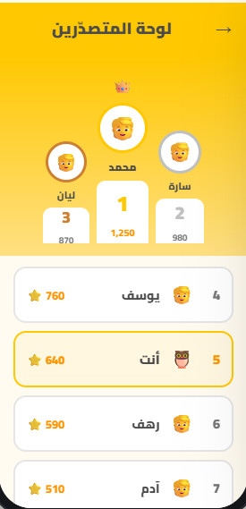
</div>
<p align="center"><em>Figure 28: Gamified leaderboard.</em></p>


### 5.3.9 Teacher Dashboard


Teachers have their own dashboard (a web build of the same application). It lists the class roster and shows each student’s progress and weak skills, helping the teacher intervene at the right time.


<div align="center">
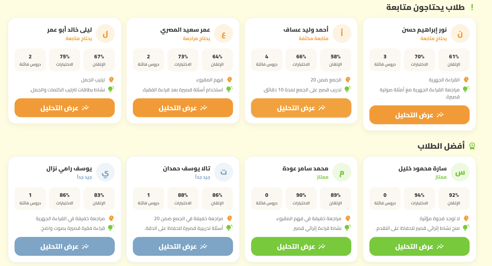
</div>
<p align="center"><em>Figure 29: Teacher analytics dashboard.</em></p>


### 5.3.10 Parent Dashboard


Parents can follow their child’s learning through a dedicated dashboard that presents a clear summary of progress and recent activity across subjects.


<div align="center">
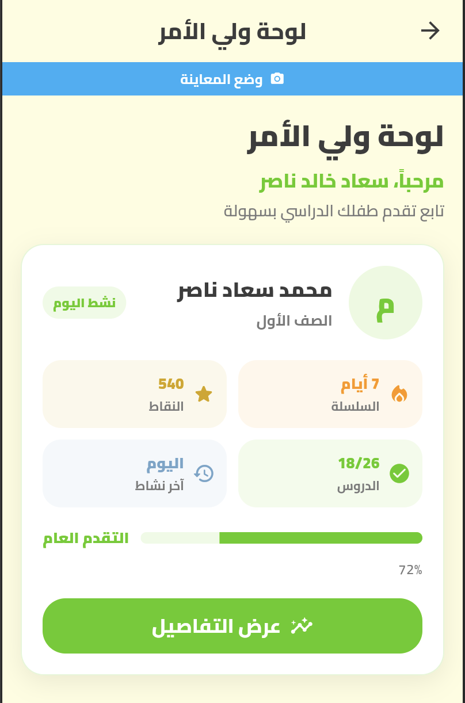
</div>
<p align="center"><em>Figure 30: Parent dashboard.</em></p>


## 5.4 Chapter Summary


This chapter described the implementation of the Manhaji platform — its layered Spring Boot backend, the Flutter client, the adaptive learning engine, and the integrated AI services — and presented the user interface of the delivered application across the student, teacher and parent experiences. The implementation realises the design from Chapter 3 as a working, demonstrable system while keeping the architecture modular and resilient to the availability of external AI services.


# Chapter 6: Conclusion


## 6.1 Review of the Project


Manhaji set out to improve early-grade learning by combining adaptive, voice-based and curriculum-aligned instruction with continuous performance analysis. This report presented the problem and motivation, the analysis and design, the testing, and the implementation of the delivered platform.


The result is a working, demonstrable system: a cross-platform application that lets young learners study by listening and speaking, scores their answers with AI, adapts to each learner’s mastery, and gives teachers and parents clear visibility of progress. The following section reviews the project against the specific objectives set out in Chapter 1.


## 6.2 Achieved Objectives


Each of the five objectives defined in Chapter 1 was addressed. They are reviewed individually below, with the result achieved for each.


Objective 1 — Intelligent Audio-Visual Instruction: Achieved.


Lessons are delivered multimodally — short text, illustrations and Arabic text-to-speech narration — so children can follow them by listening before they can read fluently, with replayable audio on every lesson and question. This meets the objective of child-friendly, voice-narrated and visually-supported instruction.


Objective 2 — Speech-Based Student Assessment: Achieved.


Pronunciation questions record the student’s voice, transcribe it through the speech service, and score it with a language-aware comparison for both Arabic and English. A learner who cannot yet read or write can therefore still answer and be assessed by speaking, exactly as the objective intended.


Objective 3 — Adaptive Questioning and Micro-Skill Tracking: Achieved.


A Bayesian Knowledge Tracing engine updates each sub-skill’s mastery after every answer, and the quiz-selection service uses these estimates to assemble personalized "Challenge Me" quizzes that concentrate on the weakest skills with mixed difficulty — meeting the objective of dynamically adapted, mastery-aware questioning.


Objective 4 — Personalized Learning Pathways: Achieved.


From a student’s performance history the system generates an AI-written personalized learning plan together with the targeted "Challenge Me" practice, directing each learner toward the lessons and skills where they need the most support. This satisfies the objective of automatically produced, data-driven learning pathways.


Objective 5 — Teacher Analytics and Monitoring Tools: Achieved (with one part for future work).


Teachers have a dashboard showing the class roster, each student’s progress and per-skill mastery, supported by AI-generated performance reports, and parents receive a clear progress summary. The early-warning, "AI-predicted risk level" element of this objective is partially met through the mastery and weak-skill views and is a natural area for future enhancement.


## 6.3 Limitations


Although the system performs its intended functions successfully, some practical limitations remain. The current curriculum content focuses on the early grades, and expansion to higher grades is ongoing. The pronunciation-scoring, AI-report and learning-path features depend on external AI services and require valid API keys; when these are unavailable the system degrades gracefully to a friendly message rather than providing a score or report. Automatic speech recognition for very young children can be affected by background noise and recording quality. Letter tracing is evaluated with an intentionally lightweight on-device heuristic rather than a machine-learning model, which keeps the application offline-capable and small but limits the granularity of handwriting feedback. Finally, the platform was validated at demonstration scale rather than in a large-scale classroom deployment.


## 6.4 Future Work


Several enhancements are planned to extend the platform beyond its current scope. Two items originally planned as future work — automated, personalized quiz generation and AI-assisted question banks — have already been delivered. The remaining work centres on teacher-driven content and an editorial approval workflow:


Lesson Content Upload


Teachers will be able to upload original lesson content in several document formats (such as PDF, DOCX and PPTX) including images and audio. Uploaded lessons will be tagged with metadata — grade, subject, unit and lesson title — for organisation and alignment to the curriculum.


Content Request and Approval Workflow


Uploaded teaching materials will be stored as requests, each in one of three states — PENDING, APPROVED or REJECTED — so that content validation and academic quality assurance take place before students gain access. Further planned directions include expanding the curriculum to additional grades and broadening the gamification layer.


## 6.5 Development Timeline


The platform was developed in incremental stages, from the backend and database foundation through the lesson, assessment and adaptive modules, to the application interface, dashboards and final integration testing. The overall development timeline is summarised below.


**Table 19: Manhaji Development Timeline**

| Implementation Stage | Start Date | End Date |
|---|---|---|
| Backend Setup & Database Creation — server, database structure and API skeleton | 20 Feb | 01 Mar |
| Multimedia Lesson Module — text-to-speech narration and image integration | 02 Mar | 15 Mar |
| Speech Answer Capture & Evaluation — speech-to-text pipeline and correctness logic | 16 Mar | 30 Mar |
| Adaptive Questioning Engine — difficulty adjustment, sub-skill tracking, auto-selection | 31 Mar | 15 Apr |
| Personalized Learning-Plan Generator — learning-profile model and recommendations | 16 Apr | 30 Apr |
| Automatic Quiz Generator — question generation from lessons and units | 01 May | 10 May |
| Student App UI — lessons, speech answers and adaptive questions | 11 May | 25 May |
| Teacher Dashboard & Analytics — progress reports, weak-skill charts, class overview | 26 May | 10 Jun |
| Integration & System Testing — app, backend and AI tested together | 11 Jun | 25 Jun |
| Final Debugging & Optimization — fixes, performance and documentation | 26 Jun | 30 Jun |
| Project Implementation Completed | 01 Jul | 01 Jul |


# Bibliography


[1] Flutter, “Flutter - Build apps for any screen,” [Online].


Available: https://flutter.dev.


[Accessed: 2026].


[2] W3Schools, “HTML / CSS / JavaScript Tutorial,” [Online].


Available: https://www.w3schools.com.


[Accessed: 2026].


[3] Spring, “Spring Boot,” [Online].


Available:


https://spring.io/projects/spring-boot/.


[Accessed: 2026].


[4] MySQL, “MySQL - Open Source Database,” [Online].


Available: https://www.mysql.com.


[Accessed: 2026].


[5] Google, "Gemini API Documentation," Google AI for Developers. [Online].


Available: https://ai.google.dev/gemini-api/docs.


[Accessed: 2026].


[5] PyPI, “SpeechRecognition,” [Online].


Available: https://pypi.org/project/SpeechRecognition/.


[Accessed: 2026].


[6] Microsoft, "Text to speech — Azure / Edge neural voice s," Microsoft Azure Cognitive Services. [Online]. Available:


https://learn.microsoft.com/azure/ai-services/speech-service/text-to-speech.


[Accessed: 2026].


[7] University of San Diego, “Artificial Intelligence in Education,” [Online]. Available: https://onlinedegrees.sandiego.edu/artificial-intelligence-education/. [Accessed: 2026].


[8] Pan, Z., Biegley, L., Taylor, A., & Zheng, H. (2023). A Systematic Review of Learning Analytics-Incorporated Instructional Interventions on Learning Management Systems. The Journal of Learning Analytics.


Available : (ResearchGate)


[9] Martínez-Martínez, A., Gómez-Cambronero, Á., Montoliu, R., & Remolar, I. (2025). Towards the Adoption of Recommender Systems in Online Education: A Framework and Implementation. Big Data and Cognitive Computing, 9(10), 259. Available :(MDPI)


[10] Bhatt, S. M. (2025). Teacher-centric educational recommender systems in K12: insights and applications. [Article].


Available: (ScienceDirect)


[11] T. M. A. Zayet and M. Ismail, “What is Needed to Build a Personalized Recommender System: A Systematic Review of E-learning in K12 (2017–2021),” PubMed Central, 2022. [Online].


Available: (PMC).


[12] Review: A systematic review of the role of learning analytics in supporting personalised learning. (2024). MDPI, Education Sciences.


Available:  (MDPI).


[13] CEUR-WS, “A Systematic Narrative Review of Learning Analytics Research in K-12,” CEUR Workshop Proceedings, 2022. [Online].


Available: (CEUR-WS)


[14] Review: A Review of Learning Analytics Opportunities and Challenges for K-12. (2023-2024). PMC. (PMC)


[15] Y. Tabasi, I. B. Tondowala, M. S. Tupamahu, F. P. Soa’e Sigilipu, and K. A. K. Septiana, “The effectiveness of technology-enhanced learning tools in English language education,” Journal on Education, vol. 6, no. 4, pp. 21589–21601, Jun. 2024.


[16] I. Abu-Ayyash, “Education in Palestine: Subsequent crises and accumulated learning loss,” Journal of Social Sciences, Democratic Arabic Center for Strategic, Political & Economic Studies, vol. 8, no. 33, pp. 51–75, Sep. 2024.


[17] Z. Yu, L. Yu, Q. Xu, W. Xu, and P. Wu, “Effects of mobile learning technologies and social media tools on student engagement and learning outcomes of English learning,” Technology, Pedagogy and Education, pp. 1–19, 2022, doi: 10.1080/1475939X.2022.2045215.


[18 ]H. Ramahi, “Education in Palestine: Current Challenges and Emancipatory Alternatives,” Rosa Luxemburg Stiftung – Regional Office Palestine, Nov. 2015.


[19] A. T. Corbett and J. R. Anderson, "Knowledge tracing: Modeling the acquisition of procedural knowledge," User Modeling and User-Adapted Interaction, vol. 4, no. 4, pp. 253–278, 1995.


[20] R. S. Baker, A. T. Corbett, and V. Aleven,"More accurate student modeling through contextual estimation of slip and guess probabilities in Bayesian Knowledge Tracing," in Proc. Int. Conf. on Intelligent Tutoring Systems (ITS), 2008, pp.406-415.


[21] V. I. Levenshtein, "Binary codes capable of correcting deletions, insertions, and reversals," Soviet Physics Doklady, vol. 10, no. 8, pp. 707–710, 1966.


[22] Ministry of Education and Higher Education, "Palestinian National Curriculum," State of Palestine. [Online]. Available: https://www.mohe.pna.ps. [Accessed: 2026].


# Appendices


## Use Case Specifications:


#### Use Case 1: Student Accesses Lesson Content (UC-1):


**Primary Actor:** Student


**Preconditions**


The student has an account in the system.


The pupil is now signed into the app.


The student is offered grade level and curriculum.


Selected lesson has been approved and published by an Admin.


Internet connection for voice narration services.


**Brief Description**


This use-case describes how a student reads and uses lessons in the Manhaji project. The lesson is presented in a multimodal way (combination of audio narration, visual illustrations/photographs and minimal text), allowing early-grade kids to learn at their own pace no matter what their reading or writing ability maybe. The system also guarantees that lessons are content-aligned, age-appropriate and adapt to the behavior of student's interaction.


**Postconditions**


**Success Postconditions**


- Lesson completion is recorded.
- User progress is stored in the database.
- The learning status of the student is maintained up to date.


**Minimal Guarantee**


student data is lost in case session is interrupted.


Trigger


The student consciously chooses a lesson from the list of all available lessons on his/her dashboard.


**Main Success Scenario (Primary Flow)**


- The student starts the Manhaji app on his or her supported device.
- The system authenticates the student and obtains a learning profile of the student, including a grade level, an assigned curriculum for the student, and prior progress thereof.
- The student dashboard appears on the screen, which indicates the subjects and lessons that are available to choose for your year level.
- The student chooses a topic through the dashboard.
- The list of lessons related to the chosen subject is loaded and displayed by the system.
- The student chooses to explore a certain lesson.
- The system checks the availability of a lesson and obtains the information (text, image and audio) for the selected lesson from database, based on which: Lesson text, visual images associated with text, Audio - data files for narration


The teaching interface is started, and the view learning content is shown on the screen.


The text-to-speech service in the system will also read out the text for you.


The student listens to the audio lesson and observes the visual materials.


Lesson segments are easy to navigate (next, previous, replay) for the student.


Audio narration is queued to the currently viewed lesson segment by the system.


- The system is always capturing detailed student interaction data such as: Time spent in each lesson part, Navigation actions, Lesson progress.


The lesson moves onto its final section for the student.


There are no remaining lesson segments that need to be visited because the system verifies if all lessons were visited.


The lesson is logged as ‘Finished’ in the learning students profile.


The database entries for the student’s progress and mastery are updated in the system.


The student is guided through available next steps, including: Proceeding to practice activities, Generating a quiz, Exiting the lesson.


**Alternative Flow A1: Student Exits Lesson Early**


**Condition:** A student tries to leave or exit out of the lesson/app before it's done.


**Flow:**


- The student exits the lesson screen intentionally or unintentionally.
- It is detected by the system that the lesson has not been accomplished.
- It saves where you last left off so no more wondering what episode you were up to.
- The student’s profile status is labelled “In Progress”.
- This saved state is recorded in the database.
- When the student next logs in, they are prompted to continue with their lesson.
- Lesson begins exactly where a student stops.


Postcondition:


No history forgotten, so that the learner can seamlessly learn again later.


Alternate Flow A2: No Audio Description


Condition:


the lesson audio is not played with TTS.


**Flow:**


- Sounds narration plays and tries to play the audio. A fault happens, or the audio service is not available. The app works to automatically reinstate the audio.
- If unsuccessful:
• The student receives a visual warning.
• All images remain available to students with vision.
- The lesson carries on in stealth mode.
The voice problem is recorded for a service request tracker.


Postcondition:


The student continues learning using visual materials without system interruption.


Alternate Flow A3: Loss of Internet Connection During the Lesson


**Condition:** The student loses their internet connection in the middle of class.


**Flow:**


- The disconnection of the network is detected by the system.
- Audio playback halts automatically.
- A no connection error message is displayed on the screen.
- The current lesson state is stored away.
- The system continuously attempts to reconnect.


Postcondition:


It's not enough to disrupt the lesson for a moment of lost connectivity.


#### Use Case 2: Student Creates a Gamified Quiz


Primary Actor


Student (early-grade learner, Grades 1–2)


**Brief Description**


This feature allows young learners to transform past lessons into an entertaining, voice-based quiz game. The app makes questions from the material they have already studied. The student answers verbally, the system listens and verifies how correct it is, awards them points, presents rewards and shows them what progress they are making in their studies.


**Preconditions**


- The learner is registered in the system.
- They’ve already done or accessed at least one lesson
- It has ready quiz material for that lesson.
- Speech recognition is working.


Trigger


The student clicks the "Start Quiz" button for a lesson.


**Postconditions**


If successful:


- The quiz result is stored by the system.
• A new level of mastery for the student is updated.
• The student is also rewarded to add points to the student’s profile gamification.


At minimum:


No progress is lost, even if the quiz is interrupted.


**Main Success Scenario (Primary Flow) – UC-2**


The student opens the Manhaji app.


The app signs them in, and their learning profile is loaded.


The system displays a list of lessons they’ve already visited.


The student selects the lesson they’d like to be quizzed on.


They choose the option to generate a gamified quiz.


The system checks that a quiz can be created for that lesson.


It grabs the key lesson points, goals, and questions.


the app builds a custom quiz including:


- A set number of questions
- An initial difficulty level


The quiz game starts! It shows: A live score counter, Fun reward icons, A progress bar


The first question is shown on the screen.


The system reads the question out loud.


It turns on voice input mode.


The student answers by speaking.


The system records the answer.


The speech-to-text tool converts the answer into written form.


AI evaluates the answer for: Accuracy, Partial understanding, Clarity.


The system marks the answer as correct, partly correct, or incorrect.


Instant feedback is given through sounds and visuals (like animations or icons).


Points are awarded based on how accurate and clear the answer was.


The quiz score is updated.


The system adjusts the difficulty for the next question.


The next question is shown.


Steps 10–22 are repeated until the quiz is complete.


The system ends the quiz.


A final score and performance summary are generated.


The system updates the student’s mastery level, lesson progress, and awards.


The quiz results are saved.


A summary screen appears showing: The score, Positive feedback, Suggestions for what to do next


**Alternative Flow A1: Speech Recognition Failure**


**Condition:** The system fails to correctly capture or transcribe the student’s spoken answer.


**Flow:**


The student submits a spoken response.


The system attempts to capture the audio input.


The speech-to-text service fails or returns an invalid transcription.


The system prompts the student to repeat the answer.


The student repeats the spoken response.


The system reattempts speech recognition.


If recognition succeeds, the system continues with answer evaluation.


If recognition fails again, the system activates a fallback input method.


The quiz proceeds without terminating the session.


Postcondition:


The quiz continues without loss of progress.


**Alternative Flow A2: Incorrect Answer Submitted**


**Condition:** The student provides an incorrect answer.


**Flow:**


The system evaluates the spoken response.


The system determines the answer is incorrect.


The system provides corrective feedback.


The system logs the error for skill-gap tracking.


The adaptive engine lowers the difficulty of the next question.


The system selects an easier or supportive follow-up question.


The quiz continues.


Postcondition:


Teaching gaps are captured and acted upon through adaptive instruction.


**Alternative Flow A3: Repeated Incorrect Answers**


**Condition:** The student answers multiple consecutive questions incorrectly.


**Flow:**


The system detects repeated incorrect responses.


The system triggers adaptive remediation logic.


The system provides additional hints or simplified explanations.


The system selects lower-difficulty questions.


The system reduces penalty impact on score.


The quiz continues with adjusted difficulty.


Postcondition:


The student stays motivated and is not discouraged.


Teacher Views Student Analytics (UC-5)


Primary Actor


Teacher


**Brief Description**


A use case for a teacher reviewing student's learning analytics is: The teacher wants to view the students' learning analytics in an online dashboard description. It also offers on-the-fly performance data, second-chance indicators of mastery, progress insights and AI-created insights to inform instructional and early actions.


**Preconditions**


- The teacher does have an account.
- The teacher is authenticated.
- Assigned students are accessible to the instructor.
- There is some data available on student outcomes.


Trigger


Once logged in, the teacher clicks on the Analytics Dashboard option.


**Postconditions**


**Success Postconditions**


Teacher adequately uses student performance data to review achievement.


No data is modified.


**Minimal Guarantee**


- Analytical data is saved, even if the session is suddenly interrupted.


**Main Success Scenario (Primary Flow) – UC-5\**


- The teacher logs in to the Manhaji web platform.
- The teacher is asked for the username and the password.
- Teacher logs in using the below valid credentials.
- The system authenticates the teacher.
- The system checks the position and permissions of teachers.
- The teacher dashboard is displayed by the system.
- The teacher clicks on the Option Student Analytics.
- The analytics report system gets the analytics data for who is assigned to the teacher.
- The system compiles student performance information.
- The system analyzes metrics; one or more of the following indicators: Lesson completion status, Quiz scores, Skill mastery level, Performance trends
- This system introduces the summary analytics view.
- The lecturer chooses a particular class or student.
- The system collects the detailed analytics for the selected scope.
- The system shows granular performance information such as: Student by student performance, Patterns of errors, Mastery gains over time.
- The system flags students who are at risk of falling behind.
- The teacher then applies optional filters (lesson, date range, skill).
- The view of analytics is updated has been filters being applied.
- The teacher reviews analytics insights.
- The teacher is returned to the analytics dashboard.


**Alternative Flow A1: Analytics Data Load Slowness
Condition:
Processing of analytics is slower than needed.**


**Flow:**


The teacher requests student analytics.


The system then starts aggregating and processing the data.


The latency for processing the data is too long.


The system is showing a loading sign.


The background processing is still running.


Analytics is shown once the processing is done.


Postcondition:


Analysis is presented without loss or corruption of data.


## Glossary

| Term | Definition |
|---|---|
| Adaptive learning systems | A self-adjusting learning environment that adapts content, difficulty and pacing to each learner based on their performance and estimated knowledge. |
| ITS (Intelligent Tutoring System) | software that provides individualized instruction or feedback to learners, typically by modelling the learner’s knowledge. |
| STT <br>(Speech-to-Text) | transcription of spoken audio into text; used to capture and evaluate the student’s spoken answers. |
| TTS <br>(Text-to-Speech) | technology that converts written text into spoken audio; used to narrate lessons and questions |
| JWT (JSON Web Token) | a signed token used to authenticate and authorize users on each request in a stateless manner. |
| LLM (Large Language Model) | a neural language model (here, Google Gemini) used for answer evaluation, hint generation, and report writing. |
| Sub-skill | the fine-grained learning competency a question targets (e.g. recognition, production, pronunciation, handwriting) and the unit at which mastery is tracked. |
| ALS | Adaptive learning systems |
| DBMS | Database management system |
| AIED | AI in Education |
| BKT (Bayesian Knowledge Tracing) | A probabilistic learner model that estimates the probability a student has mastered a skill from their sequence of correct and incorrect answers, using prior, learning-transition, slip and guess parameters. |
| Mastery Threshold | The estimated mastery probability (0.95) at which a sub-skill is treated as mastered. |
| Attempt / Student Response | An Attempt is a student’s run through a quiz; a Student Response stores a single answer with its correctness and points earned. |
| Gemini | Google’s large language model used for answer evaluation, hint generation, speech transcription and report generation. |
| Levenshtein Distance | An edit-distance metric used to score a spoken answer against the expected word. |
| Metaphone | A phonetic-encoding technique used to score English pronunciation by sound rather than spelling. |
| OpenMoji | An open-source picture set (CC BY-SA 4.0) used for the image-based question types. |
| Provider | The state-management pattern used in the Flutter client. |
| REST API | The HTTP interface through which the Flutter client communicates with the Spring Boot backend. |
| RTL (Right-to-Left) | The text layout direction used for Arabic content throughout the application. |
| Curriculum Seeding | Loading lesson and question JSON into the database at startup (the DataSeeder component). |


## Main Software Components


Manhaji follows a modular software architecture in which each component is responsible for a specific function. This design improves maintainability and makes it possible to extend the system — for example by adding new question types or subjects — without affecting the overall structure. The main components are summarised below.


### Backend Components


**Table 20: Main Backend Components**

| Component | Responsibility |
|---|---|
| AuthService / JwtService | Authenticates users and issues/validates signed JWT tokens; enforces role-based access. |
| LessonService | Serves curriculum-aligned lessons and records lesson progress and completion. |
| QuizService | Manages quiz attempts and evaluates answers for every question type (submit, pronunciation, tracing). |
| QuizSelectionService | Assembles standard and personalized ("Challenge Me") quizzes from the question bank. |
| SkillMasteryService / BktEngine | Maintains per-sub-skill mastery using Bayesian Knowledge Tracing. |
| ProgressService / ProgressReportService | Aggregates performance data and stores generated reports. |
| LearningPathService | Produces and validates personalized learning plans. |
| Teacher / Parent / Admin Service | Provide analytics, child progress and user-management functionality per role. |
| DataSeeder | Loads curriculum JSON into the database on startup and backfills new questions non-destructively. |


### AI Services


**Table 21: Main AI Services**

| Component | Responsibility |
|---|---|
| GeminiService | Calls the Gemini model for answer evaluation, hints, report and learning-path generation (JSON mode). |
| WhisperService | Transcribes recorded speech to text (Gemini-backed) for pronunciation scoring. |
| PronunciationScoringService | Language-aware scoring of spoken answers (Arabic normalisation, English phonetics, Levenshtein distance). |
| TtsService | Converts lesson and question text into spoken audio using neural voices with a fallback provider. |


### Frontend (Flutter) Components


**Table 22: Main Frontend Components**

| Component | Responsibility |
|---|---|
| Providers (auth, learning, progress, report, teacher, parent, admin) | Hold application state and coordinate calls to the backend. |
| ApiService / AuthService | Wrap REST and multipart calls and surface friendly Arabic errors on failure. |
| AudioService / TtsService | Record voice answers and play lesson and question narration. |
| LearningScreen | Drives the quiz flow and dispatches each question to its widget. |
| question_widgets/* | Render each question type (MCQ, true/false, fill-blank, ordering, short answer, pronunciation, tracing, image-MCQ, listen-choose, image-match). |
| Theme (app/theme.dart) | Centralises colours, typography and motion for a consistent, child-friendly interface. |
